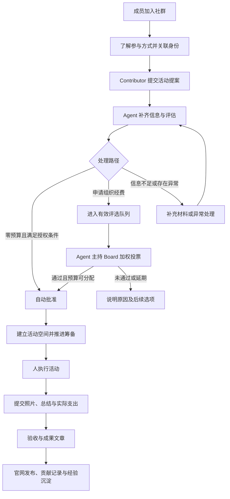

# Rein Protocol 社群自动化运营 PRD

[English version](./PRD-agent-community-operations.md)

> 产品：基于 OpenClaw 的社群运营 Agent\
> 版本：v0.1 · 产品需求草案\
> 日期：2026-09-22\
> 文档状态：OpenClaw 选型及核心业务方向已确认；新增规则与数值默认值为产品建议，尚未批准或上线。\
> 适用对象：组织发起人、Board、产品与设计、社群运营、开发及测试人员。

## 1. 产品定位与背景

Rein Protocol 希望以 Agent 承担大部分日常组织工作，让人主要参与组织方向与资源分配、线下活动执行，以及超出 Agent 权限或能力的异常处理。

本产品是常驻 Slack 或 Discord 的社群运营助手。成员通过自然语言与它交流，完成活动提案、评估、投票、筹备、验收和成果传播。官网承担活动发现、报名入口、成果展示和组织透明度建设；管理后台承担规则配置、例外处理和运营监督。

产品应让“成员有意愿发起活动”顺畅转化为“活动被执行、成果被记录、经验可复用”，减少组织发起人在群里追问、整理信息、组织投票、催交材料和发布文章的时间。

活动与内容应服务于现有组织使命：推动有益于人类社会的 AI Agent，促进 AI 教育、研究、伦理、安全和治理讨论，支持开放学习社群与公共利益实践。活动数量和传播量不能取代使命贡献。

### 1.1 典型体验

一名已认证 Contributor 在所在大学找到免费教室，在提案频道 @Agent：“我想下周六组织一场 AI Agent 论文讨论，预计 20 人，不需要经费。”

Agent 确认资格、补齐活动信息、按已授权规则评估。符合零预算快速通道时自动批准，创建活动频道，给出准备清单，发布活动入口。活动前按进度提醒负责人；活动后收集照片、人数、总结与问题，形成官网文章和贡献记录。组织发起人只在异常出现时介入。

若同一活动申请经费，则进入周期性评选。Agent 向 Board 介绍提案和资金情况，主持限时加权投票，并根据确定的规则执行结果。

### 1.2 与现有文档和产品的关系

- [PROJECT.md](../PROJECT.md) 是组织使命与长期治理蓝图。本 PRD 描述其中社群运营部分的产品化需求，不重写组织章程。
- [README.md](../README.md) 描述当前实现；其中现有 Agent 审核仍为管理员手动启动。本 PRD 描述拟新增的、在授权范围内自动启动与持续推进的运营流程，不表示现有功能已经自动化。
- 一期活动经费评选采用中心化成员名单和配置权重，作为未来治理演进的过渡。不得把一期结果描述成已上线的 DAO 或链上治理。
- 本 PRD 不自动改变既有 Contributor 录取规则、募款上线状态、隐私承诺或财务付款权限。需要变化的部分应单独配置并明确告知受影响用户。

## 2. 已确认决策、产品建议与待定事项

### 2.1 已确认的需求

| 编号 | 已确认事项 |
| --- | --- |
| C01 | 选择 OpenClaw 作为 Agent 底座，通过扩展满足组织运营需求，不从零开发通用 Agent。 |
| C02 | 通过 Slack 或 Discord 接入，成员可在群里 @Agent 发起与推进事项。 |
| C03 | Agent 主动承担日常运营，目标是显著减少发起人的持续投入。 |
| C04 | 只有具有有效 Contributor 资格的成员才能正式提交活动提案并担任活动主要负责人。 |
| C05 | Agent 评估活动可行性、预算与潜在负面影响；零预算活动应有快速批准路径。 |
| C06 | 申请组织经费的活动进入评选队列，由 Board 进行线上投票。 |
| C07 | 每周或每两周组织评选；投票窗口支持 30 或 45 分钟，Agent 主持并通知 Board。 |
| C08 | 仅有资格的 Board Member 可以投票，支持不同权重；一期由组织集中配置权重。 |
| C09 | 活动批准后，Agent 自动创建对应的活动沟通空间，主动提醒与跟进。 |
| C10 | 线下活动由人负责执行，负责人提交照片和文字总结供验收。 |
| C11 | Agent 收集活动材料、撰写成果文章并支持发布至官网。 |
| C12 | 后续开放社交媒体账号给 Agent，发布图片和文字；视频制作不属于当前需求。 |
| C13 | 为后续业务扩展和 DAO 治理保留演进空间。 |

### 2.2 本文补充的产品建议

以下为使流程完整而提出的建议：入群引导、身份关联、提案版本确认、利益冲突回避、预算占用、活动变更与取消、提醒降噪、负责人交接、报销跟进、内容发布授权、贡献记录、申诉纠错、运营摘要和异常看板。

本文标注“建议默认”的时间、门槛和数量均可调整。未经确认，不得宣传成组织已经采用的正式政策；未配置必要治理参数时，系统应明确显示未就绪，不能自行猜测并启动正式评选。

## 3. 产品目标与成功定义

### 3.1 产品目标

1. **群内完成主要流程。** 成员无需反复切换后台、表格和邮件，Agent 主动整理已提供的信息。
2. **活动能持续发生。** 支持组织每周或每两周举办活动的目标，并提前暴露候选不足、准备滞后等问题。
3. **减少日常人工运营。** 常规提案受理、提醒、材料收集、报告整理和信息同步由 Agent 完成。
4. **资源分配清晰可信。** Board 能快速理解提案、可用预算和投票影响，事后能够核对决策依据。
5. **形成完整的成果记录。** 每个活动都有负责人、进度、结果和可公开的成果，供成员、捐赠人及其他支持者了解。
6. **让贡献可以积累。** 举办经验帮助下一位负责人，持续贡献者获得清晰的参与和成长路径。

### 3.2 不以这些方式衡量成功

- 不以 Agent 回复数量、提醒数量或生成文章数量代替活动质量。
- 不为了降低人工介入率，掩盖异常、绕过 Board 或自动批准不满足条件的提案。
- 不为了达到活动频率目标，强行批准低质量活动或花完预算。
- 不把尚未发生的活动、预估人数、未到账支持承诺算作已实现成果。

## 4. 用户角色与权限

“会员／Member”在本文中指社群参与身份，不自动代表法定成员、资产所有权、治理权、雇佣关系或未来 Token 权利。

| 角色 | 主要诉求 | 可执行的核心行为 | 边界 |
| --- | --- | --- | --- |
| 访客／潜在成员 | 了解使命、发现活动 | 查看公开内容，通过开放入口报名 | 不访问社群内部资料 |
| Public Member／普通成员 | 学习、参加活动、找到同伴 | 群内咨询、报名、反馈、提出非正式活动想法、申请 Contributor | 不能正式提交提案或担任主要负责人 |
| Contributor | 发起活动、组织协作、获得支持 | 正式提案、作为负责人、筹备活动、提交成果 | 只能管理获授权的活动；不自动获得投票权 |
| Core Contributor／本地协调者 | 持续支持某个地区或主题 | 在授权范围协助匹配负责人、复用经验、支持多个活动 | 身份本身不自动增加预算或投票权 |
| 活动协作者／志愿者 | 完成具体任务 | 在活动授权范围查看任务、提交材料 | 可以是普通成员，但主要负责人须为 Contributor |
| Board Member | 分配组织资源、监督例外 | 阅读评选材料、按资格与权重投票、处理指定异常 | 权重与权限有明确记录；不得替他人投票 |
| 运营管理员 | 维护规则和处理故障 | 维护身份与授权、设置周期、处理申诉、暂停自动化 | 管理后台访问权不自动等于 Board 投票权 |
| 财务负责人 | 掌握承诺支出与实际支出 | 确认预算来源、记录付款和结算状态、处理差异 | 经费批准不自动代表付款已完成 |
| 捐赠人／支持者 | 了解资金用途与成果 | 查看公开活动、文章与汇总报告 | 不因支持组织自动取得私人资料或治理权 |
| 社群运营 Agent | 按使命与授权推进工作 | 受理、评估、提醒、主持、整理、发布及记录 | 不自行授予身份、修改权重、扩大预算或声称未经证实的事实 |

角色可重叠；涉及利益冲突时必须明确当前身份。Board Member 若要作为活动主要负责人，也需要有效 Contributor 资格。

## 5. 产品范围与交付阶段

| 阶段 | 范围 | 交付结果 |
| --- | --- | --- |
| P0：活动运营闭环 | 接入一个聊天平台；基础入群引导与身份关联；Contributor 提案；零预算快速通道；经费评选与加权投票；活动空间；筹备提醒；成果验收；官网文章；异常监督与周报 | 一场活动从提案到公开成果能完整完成，常规过程不依赖发起人逐步推动 |
| P1：持续社群运营 | 学习小组与系列活动、本地社群支持、贡献成长、需求匹配、活动反馈分析、图文社交媒体发布、按政策自动发布内容 | Agent 能维持社群节奏并提高复办与参与质量 |
| P2：规模化与治理演进 | 第二聊天平台、跨平台身份与去重、多地区协调、合作方流程、DAO 治理接入 | 在保留历史记录与责任边界的基础上扩大组织规模 |

一期不包含：视频制作、Agent 代替人执行线下工作、自动代表组织签约、全自动资金转账、Token 发行、链上投票、复杂赞助合同管理，或保证活动没有任何风险。

第二平台属于后续扩展；一期须选定 Slack 或 Discord 之一，不能因平台尚未确定而假定两者同时上线。

## 6. 使用场所与整体体验

### 6.1 建议的社群空间

| 空间 | 用途 | 主要可见范围 |
| --- | --- | --- |
| 欢迎与指南 | 使命、参与方式、行为准则、常见问题 | 社群成员 |
| 活动提案区 | 提交想法、形成正式提案、查看进度 | 成员；敏感附件另行收集 |
| 活动公告区 | 公布已批准活动、报名入口与变更 | 社群成员或公开受众 |
| Board 评选区 | 提案简报、资金概况、正式投票 | 有权限的治理参与者 |
| 单个活动空间 | 筹备、任务、协作、材料提交 | 按活动设置的负责人、协作者与参与者 |
| 私密帮助入口 | 个人信息、投诉、付款资料和其他敏感事项 | 提交者与获授权处理者 |

活动空间可以是独立频道或线程，组织可按规模选择。产品体验上，每个活动必须有可持续访问的独立入口，不要求每个小型活动都占用一个顶级频道。

### 6.2 对话原则

- 先回答当前问题，再说明下一步；一次只追问完成当前阶段所需的缺项。
- 已经提交过的信息应复用，请用户确认变更，不要求从头填写。
- 自然语言是主入口，按钮、简短命令或表单用于确认正式操作。
- 每次关键操作都返回结果、当前状态、下一位责任人和下一期限。
- 区分“已收到”“正在处理”“已成功”“失败待处理”，不以聊天承诺替代实际结果。
- 成员可随时问“我的提案到哪一步了”“我现在需要做什么”“为什么没有通过”。
- 支持成员常用语言；对外文章的主语言由组织设置，翻译不能改变数字与结论。
- 所有日期显示明确时区，跨地区活动同时提供当地时间和必要的组织统一时间。

## 7. 核心用户旅程

活动进度、经费状态和文章发布状态必须分别可见。例如，活动已经结束，但仍待结算；文章已发布，但某笔报销仍在处理。不能用一个“已完成”掩盖这些差异。

## 8. 详细需求

### 8.1 入群、身份与 Contributor 成长

**R01 · 欢迎与引导（P0）**

Agent 向新成员提供简短欢迎信息，说明组织使命、近期活动、参与方式以及如何申请 Contributor。推荐内容优先回应成员主动提供的地区与兴趣；不得推断或公开敏感个人属性。避免每个新人触发全群大量重复消息。

**R02 · 身份关联与资格核验（P0）**

- 聊天平台账号与组织会员身份建立可验证关联；显示名相同不代表同一身份。
- 提案、投票、负责人变更等关键操作必须核验当前资格。
- 未完成关联的用户可咨询与填写草稿，但正式提交前须完成关联。
- 平台角色标签可辅助展示，但不能单独成为 Contributor 或 Board 资格的唯一依据。
- 同一人在多个账号或未来多个平台出现时，不得重复获得治理身份或贡献计数。
- 资格到期、暂停或被撤销时，应说明影响并处理其未完成活动；不直接删除历史贡献。

**R03 · Contributor 申请与成长（P0 基础／P1 完善）**

普通成员想办活动时，Agent 可保存草稿、解释 Contributor 条件、引导申请，或在本人同意后邀请现有 Contributor 担任负责人。不得仅因表达办活动意愿而自动授予资格。

一期沿用现有录取与提名规则。后续可支持申请进度提醒、首次办活动指南、经验分享、协作者转负责人，以及基于已完成贡献的提名建议。核心身份与治理权的授予始终遵循单独授权的规则。

### 8.2 活动提案

**R04 · 群内自然语言提案（P0）**

Contributor 可在提案区 @Agent，或通过组织允许的私聊入口提交。Agent 将零散描述整理成结构化提案，提供可编辑摘要，由负责人确认后进入正式评估。

| 信息 | 具体需求 |
| --- | --- |
| 活动标题与类型 | 读书会、论文讨论、工作坊、公开讲座、课程学习小组、社区交流等 |
| 目的与使命关联 | 解决什么问题，参与者能获得什么，与组织使命有何关系 |
| 目标受众 | 面向谁，是否公开，是否需要先修知识，有无参与限制 |
| 负责人及协作者 | 一个主要负责人；可添加共同组织者与任务协作者 |
| 时间与地点 | 日期、时区、时长、线上／线下／混合、场地确认状态 |
| 规模与报名 | 预计人数、容量、报名方式、是否免费；收费必须明确说明 |
| 活动安排 | 简要议程、嘉宾或材料、预期产出 |
| 预算 | 组织申请金额、币种、分项用途、估价依据及不确定项 |
| 其他资源 | 免费场地、自备物资、外部支持、负责人自付及是否希望报销 |
| 准备条件与风险 | 场地许可、现场责任、参与者特殊需求、已知困难与应对 |
| 预期成果 | 总结、反馈、可公开材料；拍摄或图片发布限制 |

零预算提案不要求虚构预算明细，但必须确认没有隐含的组织付款、事后报销或合同承诺。无法拍摄的场合允许提前说明并选择替代成果材料。

**R05 · 草稿、修改与有效性（P0）**

- 提案有固定编号，负责人可查询、补充、撤回或复制为新提案。
- 正式版本保留负责人确认记录；Agent 不得悄悄修改金额、日期或承诺。
- 重复提交时提示已有记录，允许合并或继续处理，不重复进入评选。
- 已过活动日期、缺少有效负责人、必要信息长期未补齐的提案，不得混入当前有效队列。
- 建议默认：补充材料等待七天后标记“待负责人响应”，经过一次提醒再转为暂存；恢复时重新检查有效性，不自动永久拒绝。

### 8.3 评估与批准

**R06 · 可解释评估（P0）**

Agent 输出：使命关联、准备完整度、可行性、预算说明、主要不确定因素、建议处理路径和需要补充的信息。区分负责人陈述、已有证据、估算和 Agent 建议。

预算估算应说明假设；不能把模型估价当成商家报价。活动影响可以描述预期，但不能承诺必然达到人数、传播量或其他结果。

**R07 · 零预算快速通道（P0）**

符合已配置授权条件的提案可由 Agent 自动批准，不再逐项等待管理员。建议条件包括：有效 Contributor 负责、符合使命、基础信息完整、场地与执行条件可满足、属于组织允许的常规活动类型、没有需要组织额外承担的费用或未解决异常。

零预算不是无条件通过的理由。特殊场地、未知责任、严重行为争议、未经确认的合作背书等情形，需补充材料或转指定处理者。Agent 应具体说明阻塞点，避免泛泛的“存在风险”。

**R08 · 有预算的提案（P0）**

所有申请组织经费的提案进入评选流程。低预算可获得简化材料与更积极的可行性评价，但一期不因金额小就绕过 Board。未来若设小额自动批准额度，需要单独授权。

准备不充分的提案先补齐，不占用正式投票窗口。资金不足时可建议缩减范围、替代资源或零预算版本，调整必须由负责人确认。

**R09 · 评估异议与复核（P0）**

负责人可以询问理由、纠正事实或请求复核。Agent 记录原结论、补充材料及处理结果。人工修正后的同一事实，不得在没有新依据时被 Agent 反复改回。

### 8.4 周期评选与加权投票

**R10 · 评选周期与入围名单（P0）**

- 支持每周或每两周举行评选，活动举办节奏与评选节奏分别配置。
- 建议默认：每两周评选一次，每轮投票 45 分钟，至少提前 24 小时发送简报；这些均是待确认参数。
- 提案截止时间、评选时区、投票起止时间与入围条件对 Contributor 和 Board 可见。
- 本轮开始前固定提案版本、名单、权重及规则；新提案进入下一轮，不能静默插入已开始的投票。
- 无有效提案时发送简短状态说明，不召开空投票；无法达到活动目标时主动征集，而不是编造活动。

**R11 · Board 决策简报（P0）**

Agent 在投票前提供各提案的统一摘要：目标、负责人、时间地点、受众、申请金额、预算明细、准备情况、风险与待确认事项、既往相关成果，以及评估建议。

资金概况至少区分总余额、已承诺但未支付、不可用于本轮的资金、本轮可分配预算、信息更新时间。不能把总余额直接称为可用预算；无法确认时明确标记并暂停资金承诺。

Agent 可以比较方案、解释取舍，但必须区分事实与建议，不能隐去不利信息或把自己的偏好变成投票结果。

**R12 · 投票参与与表达（P0）**

- 到点开放投票并 @本轮有资格的 Board Member，说明结束时间和参与方式。
- 支持逐提案“赞成／反对／弃权”；成员可以回复 Agent，或使用确认控件。
- 自然语言必须指向明确提案及选项；“我觉得不错”“随便”“赞成第二个但预算再看看”等模糊表达需确认后才记录。
- 投票成功后返回提案、选项、采用的权重、记录时间和是否替换旧票。
- 建议默认：截止前允许本人改票，只保留最后一次有效选择用于计票，保留历史供核对。
- 禁止代投、重复计票与截止后补票；未投票、弃权和反对分别展示。
- Agent 回答提案问题不得提前泄露仅限特定处理者访问的隐私材料。

**R13 · 资格、权重与利益冲突（P0）**

Board 名单与权重由有权限的人员维护，变更可追溯。一般变更从下一轮生效，已开始轮次保持其公布的版本。

建议：提案负责人及有直接利益关联的 Board Member 对该提案回避，Agent 提醒披露并展示回避情况。管理员不能通过更改显示名或临时加权改变正在进行的结果。

若发生账号失窃、资格失效等重大异常，可以按异常权限暂停相关轮次，说明影响并决定重开；不能秘密删改票数来修正结果。

**R14 · 一期建议计票规则（P0，需组织确认）**

以下为可直接讨论的默认方案，不代表组织已采用：

1. 每个提案独立计算；回避者从该提案的有资格人数和权重中排除。
2. 有资格成员中，至少一半人数参与，并且参与权重达到该提案总有资格权重的一半，才达到参与要求；人数向上取整。
3. 明确的赞成、反对、弃权都计入参与；弃权不计入赞成或反对的比较分母。
4. 赞成权重严格大于赞成与反对总权重的一半，且至少有一票非弃权，视为通过支持门槛；平票不通过。
5. 未达到参与要求标记“参与不足，延期处理”，不等同于被否决；所有人回避或弃权时不能自动通过。
6. 达到支持门槛后还需确认资源可分配，才最终批准。通过支持门槛不等于资金已经到账。

示例：三名有资格成员的权重为 3、2、1，两人投赞成和反对，权重分别为 3 和 2。人数及参与权重满足建议参与要求，赞成占非弃权权重的 3/5，因此达到支持门槛。若只有权重 3 的一人投票，则因参与人数不足不能通过。

若这些成员同时担任法定董事，本产品的活动经费评选记录不能未经确认就被当作适用于所有事项的正式董事会决议。产品需明确标示决策类型，并容纳组织另行要求的正式确认记录。

**R15 · 多提案与预算竞争（P0）**

一期建议采用逐提案通过门槛的方式，并在开始前公布本轮预算。当达到支持门槛的提案总额超过预算时，展示差额，转入明确的优先级选择或下一轮处理；一期不让 Agent 自行选择赢家，也不按消息处理先后抢占资金。

在不足预算的情形下，提案保持“支持门槛通过，待资金分配”，不得对外宣布最终获批或承诺拨款。组织可提前采用另一套明确的排序规则，但不能在看到票数后临时更换规则。

**R16 · 截止、结果与异常（P0）**

投票截止后停止收票并公布：适用规则、有效与无效票、各选项权重、参与情况、回避情况、最终状态和下一步。结果可以追溯到相应提案版本。

若服务短暂中断，恢复后仍按原截止时间处理；未被成功确认的选票不得推定已投。若中断显著影响公平参与，应由获授权处理者宣布作废重开或其他预先规定的方案，不能暗中延长或补造选票。

### 8.5 活动空间与筹备执行

**R17 · 自动建立活动空间（P0）**

最终批准后，Agent 创建活动空间，邀请负责人及获授权协作者，发布固定摘要：目标、日期地点、批准预算、负责人、任务、报名入口、成果要求和变更方式。

创建失败时显示“已批准，活动空间待建立”，通知处理者并重试；不得为同一活动重复创建多个空间。Board 讨论、支付资料和私人联系方式不得自动复制进公开频道。

**R18 · 筹备清单与主动跟进（P0）**

Agent 按活动类型生成准备清单，负责人可以调整任务、认领者和期限。典型任务包括场地、讲者、议程、宣传、报名、物资、现场安排、参与者支持和成果收集。

建议默认提醒节奏：活动前七天检查准备情况；前三天检查阻塞；前一天确认执行；结束后一天邀请提交材料；结束后三天提醒未完成事项。活动提得较晚时压缩为合理清单，不追发所有已错过提醒。

Agent 应根据实际进度、负责人回复和缺项触发提醒。用户可设置安静时段、暂缓提醒及下次跟进时间。建议普通催办每天最多一次，紧急变更另行通知；连续两次无回应时生成一个待处理异常，不无限刷屏。

**R19 · 报名与参与者沟通（P0 基础／P1 完善）**

批准后按活动公开设置发布活动页或报名入口，清楚说明受众、时间、地点、容量、费用及联系人。Agent 回答常见问题、发送报名确认及变更通知。

未加入社群的公众应能通过官网提供的公开入口了解和参与开放活动。P1 增加候补、取消报名、空位递补和参与偏好订阅。名单不公开，人数统计区分报名、确认和实际参与。

**R20 · 资源协助与变更（P0）**

负责人可请求物资建议、嘉宾邀请文案、任务拆解和已授权资源的匹配。涉及他人承诺或费用时，Agent 应先获得相应授权，不能擅自代表合作方同意。

| 变更 | 建议处理方式 |
| --- | --- |
| 不增加风险或预算的普通议程调整 | 负责人确认，Agent 更新记录 |
| 时间、地点或容量调整 | 更新受影响信息、提醒安排与报名通知，并重新检查冲突和准备条件 |
| 增加经费、显著改变活动性质或出现新异常 | 暂停受影响承诺，重新评估；新增经费按审批规则处理 |
| 更换负责人 | 新负责人须有有效 Contributor 资格并确认接手；无人接手则暂停 |
| 取消活动 | 说明原因，停止提醒和报名、通知相关人、处理已发生费用并释放未使用额度 |

已使用经费的取消活动仍须提交简短结果和结算说明。延期或取消不自动等于负责人失职，应根据原因记录与改进。

### 8.6 经费与结算

**R21 · 资金状态可理解（P0）**

每场活动显示申请金额、批准上限、已占用额度、已支付金额、实际支出、待结算及未使用金额。明确区分“预算获批”“可申请付款”“已付款”和“已结算”。

一期至少支持组织指定财务负责人更新资金记录、附上核对依据及更新时间。Agent 负责提醒与整理，不自行把未经确认的金额称为实际到账或实际支付。

**R22 · 报销与差异处理（P0）**

负责人按组织政策提交费用类别、金额、币种、凭证及用途。个人支付信息通过私密入口收集。Agent 检查缺项、重复凭证和与批准预算的差异，向指定处理者提交完整摘要。

超支不自动视为已批准报销；预算剩余不自动授权挪作其他用途。涉及多币种时显示原币及组织选定的核算币种，换算依据和时间可见；无法确定时保留待核对状态。

付款执行不属于一期自动化承诺。通过投票后仍应明确告诉负责人什么时候可以发生费用、由谁付款、如何结算，避免要求负责人先垫付却没有后续安排。

### 8.7 活动验收与经验沉淀

**R23 · 群内提交成果（P0）**

负责人在活动空间上传材料并 @Agent 即可开始验收。Agent 关联分次提交的材料，避免重复索取已经提供的内容。

基础材料包括：实际举办时间地点、简要过程、实际参与人数及统计依据、主要收获、照片或允许的替代材料、实际费用、遇到的问题和改进建议。

不能拍照、参与者不愿公开或材料意外丢失时，允许说明原因，并提交讲义、匿名反馈、场地记录等替代证据。不得要求上传不愿公开者的可识别照片才能完成流程。

**R24 · 验收结论（P0）**

- 基于预先公布的成果要求检查完整性与一致性，区分“材料齐全”与“所有事实已经独立证实”。
- 常规活动、材料符合要求且无异常时，Agent 可在授权范围完成验收。
- 信息缺失时列出具体补充项；数字矛盾、支出差异或投诉时转为待核实，给负责人说明机会。
- 照片不单独证明参加人数、活动质量或资金使用真实性；总结不凭空填补缺失事实。
- 超期未交时提醒、记录待处理事项，并按组织规则影响后续负责资格；不得立即公开羞辱或自动永久封禁。
- 活动验收、财务结算与文章发布各自记录进度；全部必要事项完成后才归档。

**R25 · 贡献与经验记录（P0 基础／P1 完善）**

记录负责人和协作者的实际贡献、已验收结果、可复用材料及明确的问题。公开展示姓名、照片或贡献故事需要相应授权。

Agent 可形成“本活动下次如何办得更好”的内部记录，并推荐给类似活动负责人。经验用于改进执行，不自动变成新的组织规则或投票权。

### 8.8 官网文章与传播

**R26 · 活动成果文章（P0）**

Agent 根据验收材料生成文章，覆盖活动背景、发生了什么、参与者获得什么、可公开成果、经费概况（若适合公开）、感谢与后续参与入口。

文章中的人数、日期、金额、引语和合作方称谓须与材料一致；缺失信息可以省略或标明待核实，不得捏造好评或引用。会议期间举办的独立活动，不能未经确认写成官方会议合作活动。

文章和照片分别支持修改、移除和重新提交。保留实际活动照片，不用生成图片冒充现场纪实；生成插图可用于明确属于视觉说明的场景。

**R27 · 发布授权与纠错（P0）**

建议试点期：Agent 生成文章后由负责人在群内确认事实与图片权限，确认后自动发布；发起人不需要逐篇编辑或审批。负责人不响应时保持待确认，不把沉默当同意。

P1 可对满足明确条件的常规内容启用政策授权自动发布，异常内容再升级处理。发布前应确认所用材料适用于相应公开渠道；投稿到群里不自动等于授权官网和所有社交平台使用。

发布完成后向活动空间回传链接。后续发现错误时允许请求更正、撤下图片或暂时下架，记录修改原因，并同步处理已生成的后续传播内容。

**R28 · 社交媒体图文（P1）**

在组织授权的账号和渠道上，将已确认的活动信息或成果文章改写为图文帖子，支持预告、报名提醒、成果摘要和课程资源推荐。

具体需求：按平台调整长度与图片；保留活动或文章链接；设置发布时间和频率上限；发布失败可重试但不能重复发帖；取消或改期时撤销过时排程；敏感或争议内容交由指定处理者。

一期不要求自动处理社交平台私信、参与争论、购买推广或制作视频。账号权限未就绪时显示“待接入”，不能声称已发布。

## 9. 扩展的组织运营场景

### 9.1 社群日常问答与信息维护（P0）

Agent 回答使命、活动、参与方法、Contributor 路径等常见问题，优先依据组织已确认的信息。对未确定的政策直接说明未确定，指向负责人或待决事项，不虚构组织承诺。

重复问题应沉淀为可维护的 FAQ，政策更新后同步修正相关回答。Agent 身份应清楚可见，成员能够请求人工协助。

### 9.2 每周运营摘要与异常中心（P0）

Agent 向组织负责人提供一份简洁摘要：新成员与 Contributor 进展、本周活动、未来两周安排、提案与评选进展、预算承诺、未完成验收、已发布成果及需要决策的事项。

摘要首先突出“需要你做什么”，将普通状态与需要行动的异常分开。每项异常有原因、影响、处理人、截止时间和建议；重复异常合并，不逐条轰炸通知。

管理者可以查看记录、纠正错误、重新分配处理者，或暂停某类操作、某场活动及整个 Agent 的主动动作。暂停后清楚显示影响范围，恢复前核对过期任务，避免一次性补发大量通知。

### 9.3 活动供给不足时的主动征集（P1）

未来两周没有足够活动时，Agent 可发布一次有针对性的征集，根据已表达的兴趣推荐读书会、课程学习小组或公开讨论主题，提供零预算模板。

成员同意后才成为负责人；Agent 不能替某位成员接受任务。没有合格负责人或合适方案时，周报如实说明缺口。

### 9.4 系列活动、课程学习小组与本地社群（P1）

支持一个主题下的多次活动，保留共同介绍和负责人，每次单独记录时间、参与和成果。不能用一次批准无限续办或无限增加经费；授权必须有明确次数、期限和额度。

本地协调者可查看其获授权区域的活动概况、推荐协作者和复用模板。持续举办并不自动取得代表组织签约、募款或对外建立正式分支机构的权力。

### 9.5 志愿协作与资源匹配（P1）

负责人提出“需要一位主持人”“想找熟悉 Agent 安全的讲者”等需求，Agent 根据成员主动填写的能力与参与意愿推荐候选人。邀请、接手和交付都明确确认，允许拒绝而不影响成员身份。

优先推荐已有公开或获授权资料，不暴露私人联系方式。外部资源支持必须记录条件，不能将带有额外承诺的支持简单当成免费资源。

### 9.6 反馈、投诉与改进（P0 私密入口／P1 分析）

活动结束后提供可选的简短反馈入口，关注内容价值、参与体验、可访问性及后续需求。反馈数量和收集方式与结论一起呈现，避免把少量意见外推成全体共识。

投诉通过私密入口处理，Agent 先确认收到，再转给无直接利益冲突的指定处理者。涉及安全或持续伤害的事项可以按授权立即暂停相关活动或内容；Agent 不独立裁定复杂争议，也不将投诉细节公布到活动频道。

### 9.7 面向捐赠人与支持者的成果透明度（P1）

周期性汇总已举办活动、受益情况、公开材料与经费用途，并明确数据完整性。跨活动参与人次与去重人数分别展示，不能相加后统称独立受益人数。

组织以真实成果向捐赠人、合作方及其他支持者展示价值。“投资人”若用于泛指支持者，不应被自动改写成股权、回报或 Token 承诺。募款与投资产品不在本 PRD 范围内。

## 10. 具体应用场景与 User Story

下述姓名、地点和金额为说明流程的虚构示例，不作为实际成员、活动或业务数据。

### US01 · 新成员找到参与方式

**作为**刚加入社群的学生，**我希望**Agent 告诉我可以参加什么、怎样逐步承担责任，**以便**不用先理解整个组织结构就能参与。

**场景：**小林加入 Discord，表示对 AI 安全感兴趣。Agent 推荐真实存在的近期活动或课程；没有合适活动时如实说明，并提供兴趣登记与 Contributor 申请入口。

**验收：**欢迎信息简短；推荐不捏造；申请 Contributor 是可选行动，普通成员仍能参加开放活动。

### US02 · 普通成员提出想法但不越权

**作为**尚未成为 Contributor 的成员，**我希望**先保存活动想法并获得资格指引，**以便**知道怎样把想法变成正式活动。

**场景：**小林 @Agent 想办一次讲座。Agent 保存草稿，解释资格要求，并在小林同意后帮助联系愿意负责的 Contributor。

**验收：**草稿不会进入正式投票；未授予资格前不能成为主要负责人；不会丢失已填写信息。

### US03 · 零预算校园读书会快速获批

**作为**Contributor，**我希望**免费场地的小型读书会快速通过，**以便**不为简单活动等待整轮 Board 会议。

**场景：**Maya 提议在学校举办 15 人论文讨论，场地已确认，组织申请经费为零。Agent 确认没有事后报销需求、检查已授权条件后批准，建立活动空间和任务清单。

**验收：**常规合格提案无需人工逐步操作；批准附理由与责任说明；不漏问影响执行的关键条件。

### US04 · 零预算但准备条件不足

**作为**活动负责人，**我希望**知道提案具体哪里不足，**以便**补齐后继续推进。

**场景：**一场预计 200 人的免费户外活动尚未确认场地及现场责任。Agent 不因预算为零自动批准，而是要求补齐关键条件并提供较小规模的替代建议。

**验收：**解释具体、不一概拒绝；有恢复路径；未补齐前不公开宣称活动已获组织批准。

### US05 · 申请小额活动经费

**作为**Contributor，**我希望**Agent 帮我整理合理预算并进入评选，**以便**无需自己编写复杂申请材料。

**场景：**Chen 申请 180 美元举办工作坊。Agent 整理场地、材料和其他用途，标注估价依据，负责人确认后进入最近符合截止条件的轮次。

**验收：**保留币种及明细；Agent 不自行增加金额；低预算不跳过一期 Board 流程。

### US06 · Board 快速理解并投票

**作为**Board Member，**我希望**在同一频道看到提案、可用资金和投票规则，**以便**在 45 分钟内作出有依据的决定。

**场景：**Agent 提前发送三份提案摘要，到点开放投票。成员回复“赞成 EV-012，反对 EV-013，EV-014 弃权”，收到逐项确认与自身权重。

**验收：**仅记录有资格成员的明确选择；普通成员的同样回复不会计票；截止前改票可核对。

### US07 · 通过支持门槛但总预算不足

**作为**Board Member，**我希望**知道多个受支持活动能否同时负担，**以便**明确选择优先级。

**场景：**本轮可分配 300 美元，两份分别申请 200 与 180 美元的提案达到支持门槛。Agent 说明超出 80 美元，转为待资金分配，组织按公布规则决定优先级或调整方案。

**验收：**不会把 380 美元都承诺出去；不会擅自缩减某一提案预算并宣告批准；调整后由负责人确认可执行性。

### US08 · Agent 根据进度协助筹备

**作为**首次办活动的负责人，**我希望**Agent 在正确时间提醒缺项，**以便**不遗漏准备工作。

**场景：**距离活动三天，场地已完成而议程未确认。Agent 只跟进议程。负责人回复“明天下午给”，Agent 调整跟进时间，提供议程模板。

**验收：**完成事项不再催办；尊重约定与安静时段；没有要求组织发起人转发提醒。

### US09 · 负责人退出与交接

**作为**临时无法继续组织活动的 Contributor，**我希望**明确交接或取消，**以便**参与者和资源不会被遗忘。

**场景：**负责人因个人安排退出，Agent 展示待办，邀请获同意的新 Contributor 接手。未找到接手者时暂停报名并通知指定处理者。

**验收：**不把责任静默转给其他人；新负责人明确接受；旧负责人权限与后续提醒同步更新。

### US10 · 改期或取消后同步全部信息

**作为**已报名参与者，**我希望**及时获知活动变更，**以便**不按旧信息到场。

**场景：**场地不可用，活动推迟一周。Agent 更新活动入口、群公告、相关提醒和未发布宣传；取消时停止报名并处理资金占用。

**验收：**不存在继续发送的旧时间提醒；通知失败列为待处理；已支付费用不被当作可直接释放余额。

### US11 · 提交成果且尊重拍摄限制

**作为**负责人，**我希望**分次上传材料或提供替代证据，**以便**真实完成验收而不强迫参与者公开照片。

**场景：**活动有讲义和匿名反馈，但部分参与者不同意拍照。负责人提交说明和获许可的局部照片，Agent 检查缺项并形成验收摘要。

**验收：**不会要求曝光未同意者；人数标明统计依据；不把材料齐全描述为所有事实独立核验。

### US12 · 成果发布而无需创始人编辑

**作为**活动负责人，**我希望**Agent 从材料生成文章，我只需确认事实，**以便**成果及时公开。

**场景：**Agent 写成草稿，负责人纠正一个人数并移除一张照片，确认后文章发布至官网，链接回传活动频道。

**验收：**修改实际生效；使用已授权素材；重复确认不会发布两篇文章；负责人沉默时不自动当作同意。

### US13 · 财务差异有明确处理人

**作为**财务负责人，**我希望**看到批准与实际支出的差异，**以便**快速完成结算。

**场景：**预算批准 180 美元，实际花费 165 美元；Agent 整理凭证，提示未使用 15 美元。若实际为 195 美元，则指出超支并按规则请求处理，不自动承诺报销。

**验收：**实际支出与付款状态不混淆；敏感资料不出现在公开文章中；结算有明确责任人。

### US14 · 发起人只处理必要异常

**作为**组织发起人，**我希望**每周只看到需要我介入的事项及整体摘要，**以便**无需阅读所有活动频道。

**场景：**一周三场活动，只有一场因负责人失联需要处理。Agent 汇总其余进展，并把这一个异常连同建议和期限突出展示。

**验收：**重复异常合并；正常活动继续自动推进；处理后异常关闭且不反复提示。

### US15 · 服务中断后不重复操作

**作为**成员和管理者，**我希望**服务恢复后继续原有流程，**以便**无需重新提交或担心重复计票。

**场景：**投票期间服务中断，恢复后 Agent 保留已确认票据，按原截止时间给出状态；通知是否需要重开。已批准活动不会再次创建频道或重复发布文章。

**验收：**不虚构中断期间的操作；已有记录可核对；恢复中的异常有明确说明。

### US16 · 复用活动经验并推广成果

**作为**本地协调者，**我希望**复用上一场的清单与经验，**以便**下次活动更容易组织。

**场景：**上一场工作坊的匿名反馈显示入门材料不足。Agent 为下一场建议预习资料，生成新的提案草稿；成果确认后再按授权排程社交媒体图文。

**验收：**复制不会自动继承旧预算批准；学习建议与正式规则分开；未授权账号不会发帖。

## 11. Agent 自主权限与人工介入原则

| 行为类型 | 默认处理方式 |
| --- | --- |
| 欢迎、常见问题、补齐提案、状态查询、准备清单、常规提醒、周报 | Agent 在组织设定范围内自动执行 |
| 零预算活动批准、常规验收、创建活动空间 | 满足明确授权条件后自动执行，记录依据 |
| 有预算活动批准与资源竞争 | 按 Board 评选及资金分配规则执行 |
| 草稿事实确认、关键提案修改、接手责任 | 由相应负责人明确确认 |
| 试点期官网发布 | 负责人确认事实和素材后自动发布，无需创始人逐篇审批 |
| 身份与权重变更、授权扩大、复杂争议、重大异常 | 指定有权限的人处理，记录理由 |
| 线下主持、场地执行、真实支出与现场安全工作 | 由人承担；Agent 协助准备、跟进与记录 |

人工介入要有明确原因和责任人，不能把所有不确定性都堆给创始人。解决一次异常后应记录是否可通过更清晰的规则、材料或功能减少重复介入。

## 12. 信息可见性与透明度

| 信息类别 | 默认范围 |
| --- | --- |
| 已公开活动介绍、经确认的成果文章 | 公开 |
| 成员指南、普通活动进度 | 社群或指定活动成员 |
| Board 讨论、逐人选票与治理材料 | 获授权治理参与者；对外披露范围由组织确定 |
| 报名名单、联系方式、付款资料、原始投诉 | 仅完成相应工作所需的处理者 |
| 决策摘要、预算使用汇总、Agent 操作与异常记录 | 按组织政策提供内部监督或公开摘要 |

Agent 在公开频道被询问内部信息时，应解释无法公开的范围并提供适当入口。成员主动上传的内容不因此自动获得跨频道、官网或社交平台传播授权。

本产品处理聊天中主动提交的文字和图片，不引入会议录音、转录或对私人会议的分析。成员能了解哪些材料会交给 Agent 处理，并请求纠正或依政策删除个人资料；必要的决策记录保留范围和期限需另行明确。

## 13. 产品质量与验收要求

### 13.1 体验与可靠性

- 用户操作后应及时收到明确反馈；耗时处理显示进行中和失败后的处理方式。
- 并发的不同活动、不同负责人不会串用预算、材料或私人讨论。
- 重复消息、重复点击和恢复重试不应造成重复选票、资金承诺、频道或文章。
- 关键结果具有可核对记录：谁发起、何时发生、适用规则、结果和变更理由。
- 模型不可用时，已确认记录保留，正式截止与权限规则仍有效；不得输出猜测性的成功结果。
- 自动化暂停和恢复有清楚状态；临近截止或已过期的任务不能悄悄丢失。
- 官网公开材料与群内已确认结果保持一致，旧信息可被识别和纠正。

### 13.2 P0 上线验收清单

| 编号 | 可验证结果 |
| --- | --- |
| AC01 | 普通成员可咨询、保存想法，但不能绕过 Contributor 资格正式提交或负责活动。 |
| AC02 | 有效 Contributor 可通过群内对话完成提案，确认后的摘要包含本场活动必要信息。 |
| AC03 | 合格零预算提案可自动批准；不满足条件时有明确补充或异常路径。 |
| AC04 | 所有申请组织经费的提案进入既定评选，不被 Agent 私自批准。 |
| AC05 | 评选前展示有效版本、资金信息、参与名单、权重、规则及截止时间。 |
| AC06 | 无资格用户、模糊表达、代投及截止后投票不会成为有效选票。 |
| AC07 | 按配置正确处理权重、改票、弃权、回避、平票与参与不足，并给出解释。 |
| AC08 | 多提案总额超过可分配预算时不会超额承诺，也不会按处理顺序私自决定获批者。 |
| AC09 | 最终批准后建立唯一活动空间；创建失败时保持真实状态并可恢复。 |
| AC10 | Agent 依据实际缺项提醒，完成任务、暂缓提醒和活动改期都会改变后续通知。 |
| AC11 | 变更、取消和负责人交接同步影响报名、公告、提醒及预算状态。 |
| AC12 | 活动照片、总结、人数和费用可分次提交，缺项及异常被正确识别。 |
| AC13 | 无可公开照片时有替代材料路径，未经授权的素材不会进入公开文章。 |
| AC14 | 草稿修改及事实确认能驱动唯一文章发布，并把有效链接回传活动空间。 |
| AC15 | 预算批准、实际支出、付款与结算状态分别展示，未确认的付款不能称为已支付。 |
| AC16 | 活动私密信息和 Board 材料不会因公开询问或跨活动上下文被泄露。 |
| AC17 | 服务中断恢复不丢失已确认记录、不重复执行关键操作，公平性异常被明确提出。 |
| AC18 | 周报能区分正常进展和待决异常，每项异常有处理人、建议及状态。 |
| AC19 | 管理者可以暂停和恢复相应自动化，并查看受影响事项。 |
| AC20 | 完整演练一次零预算活动与一次预算活动，从提案到成果和结算记录均可追踪。 |

## 14. 运营指标与试点目标

以下为建议试点目标，需以实际活动量建立基线后校准；没有数据时显示“暂无数据”，不显示虚构百分比。

| 指标 | 定义 | 建议试点目标 |
| --- | --- | --- |
| 发起人日常运营投入 | 每周处理本产品范围内常规运营的实际时间，单列 Board 会议和线下执行 | 相比试点前减少至少 50% |
| 常规步骤自动完成率 | 无管理员介入完成的已授权常规步骤／全部同类步骤；不把必须投票的事项算失败 | 达到 80% 后再扩大自动化范围 |
| 提案反馈时效 | 从正式提交到首次明确结果或补充要求的时间 | 常规提案目标 24 小时内；即时交互另记录延迟 |
| 活动举办节奏 | 实际举办的活动数与时间分布 | 根据组织选择，维持每周或每两周一次的目标节奏 |
| 提案转化情况 | 草稿、有效提案、获批、实际举办分别统计 | 建立基线，分析主要流失阶段，不要求全部通过 |
| 成果提交及时率 | 在约定期限内提交基础材料的已举办活动占比 | 建议 80% 在结束后七天内完成 |
| 成果发布时间 | 从必要材料齐全且确认完成到官网可见的时间 | 建议一个工作日内 |
| 治理记录准确性 | 身份、权重、截止和资金分配规则是否正确执行 | 上线演练全部通过；生产中任何实质错误均处理为异常 |
| 重复与遗漏 | 重复建频道、重复发文、漏掉已确认票或过期提醒 | 关键流程不允许重复执行；发现后可核对和纠正 |
| 成员与负责人体验 | 简短可选反馈及再次参与／再次举办意愿 | 先建立基线，不以提醒增多换取“活跃” |

月度复盘应关注：哪些常规任务仍需要人工、哪些提醒没有价值、哪些提案总在相同环节停滞，以及是否出现自动化节省时间但降低参与体验的情况。

## 15. 上线与扩展顺序

1. **规则就绪。** 确认首个平台、身份来源、Board 与权重、评选规则、授权范围、资金更新方式及异常处理人。
2. **内部演练。** 使用明确标记的测试活动覆盖权限、预算竞争、截止、中断、改期、验收和发布，不混入公开成果统计。
3. **有限真实试点。** 选择少量 Contributor，跑通零预算活动与有预算活动，观察发起人投入与异常数量。
4. **扩大常规自动化。** 在已有授权内减少重复人工操作，逐步扩展活动类型；政策授权自动发布需要单独启用。
5. **扩展社群运营。** 增加系列活动、协作匹配、社交媒体图文和第二平台；保留原有身份、提案和贡献记录。

## 16. 待确认决策

这些是产品配置与治理决策，不应成为撰写 PRD 或继续设计的阻塞；进入正式上线前须明确必要项。

| 决策 | 建议或选项 | 最迟确定阶段 |
| --- | --- | --- |
| 首个聊天平台 | Discord 或 Slack，择一先上线 | P0 详细设计 |
| 评选频率与时区 | 建议双周，明确组织时区 | 真实评选前 |
| 投票窗口及提前通知 | 建议 45 分钟，提前至少 24 小时发简报 | 真实评选前 |
| 参与要求、门槛、回避及预算竞争规则 | 讨论 R13–R15 建议方案 | 真实评选前 |
| Board 名单和权重维护者 | 明确授权人员；一般修改下一轮生效 | 真实评选前 |
| 零预算授权活动范围 | 从常规小型教育和讨论活动开始，列明例外 | 自动批准前 |
| Contributor 资格与关联方式 | 沿用既有资格制度，明确平台关联流程 | 正式提案前 |
| 经费来源、核算币种和更新责任人 | 确定权威资金概况与核对节奏 | 有预算活动前 |
| 付款、报销与结算要求 | 明确垫付条件、凭证和处理期限 | 有预算活动前 |
| 负责人和协作者的公开范围 | 本人授权，区分内部责任与公开署名 | 公开活动前 |
| 成果期限与试点发布模式 | 建议七天提交；负责人确认后自动发布 | 首场活动前 |
| 素材授权、保留期限和删除处理 | 区分群内、官网、社交媒体用途 | 收集真实材料前 |
| 异常、申诉与紧急处理人 | 按事项明确主负责人及替补 | 真实试点前 |
| 第一批社交媒体账号 | 根据组织受众与可用权限选择 | P1 启用前 |

## 17. 产品边界与后续演进

OpenClaw 是已选择的运营底座。用户不需要理解其内部实现；产品应以“Agent 为我完成了什么、还需要谁做什么”呈现，而不是暴露框架概念。

活动、会员、预算、投票、材料和文章应作为组织持续拥有的业务记录。后续更换模型、增加平台或接入 DAO，不应要求成员从头建立身份或丢失历史结果。

DAO 指去中心化自治组织，匿名不是必要条件。未来治理身份、权重来源、表决机制与执行方式可以演进，但必须继续让成员看懂：谁有资格、采用什么规则、为什么得出结果，以及发生问题时由谁负责处理。

本文的交付目标是一个能够持续推进真实活动、减少日常人工运营并留下可信成果的产品。OpenClaw 选型不等于上述需求已具备；实际完成以用户旅程和验收结果为准。
