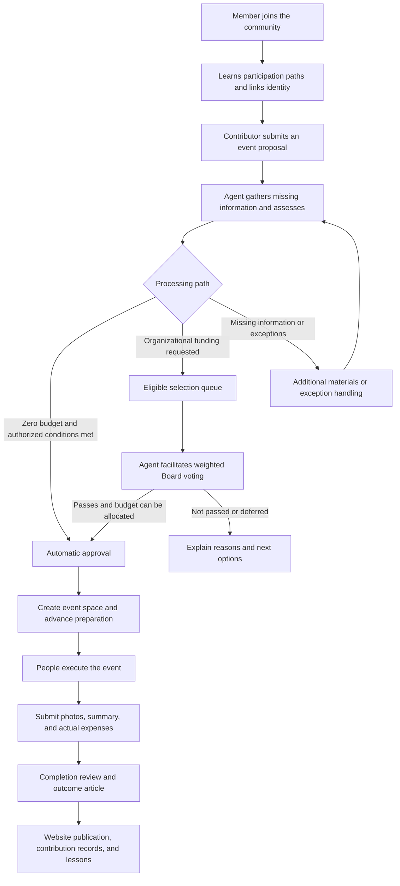

# Rein Protocol Community Operations Automation PRD

[Chinese version](./PRD-agent-community-operations-zh.md)

> Product: OpenClaw-based community operations Agent\
> Version: v0.1 · Product requirements draft\
> Date: 2026-09-22\
> Status: The OpenClaw selection and core business direction are confirmed. Additional rules and numerical defaults are product recommendations, not yet approved or live.\
> Audience: Organization founders, Board members, product and design teams, community operators, developers, and testers.

## 1. Product Positioning and Background

Rein Protocol intends to delegate most routine organizational work to Agents. People should primarily focus on organizational direction and resource allocation, executing in-person events, and handling exceptions beyond the Agent's authority or capabilities.

This product is a persistent community operations assistant in Slack or Discord. Members use natural language to propose events, receive assessments, vote, prepare activities, submit results for review, and share outcomes. The public website supports event discovery, registration, outcome reporting, and organizational transparency. The administration interface supports policy configuration, exception handling, and operational oversight.

The product should turn a member's willingness to organize an event into an executed activity with recorded outcomes and reusable lessons. It should reduce the time founders spend following up in chat, organizing information, arranging votes, requesting reports, and publishing articles.

Events and content must serve the organization's existing mission: advancing AI Agents that benefit human society; promoting AI education, research, ethics, safety, and governance discussions; and supporting open learning communities and public-benefit activities. Event counts and reach cannot substitute for mission contribution.

### 1.1 Typical Experience

A verified Contributor finds a free classroom at their university and mentions the Agent in the proposal channel: “I'd like to run an AI Agent paper discussion next Saturday for around 20 people. No funding is needed.”

The Agent checks eligibility, gathers missing information, and assesses the proposal under authorized rules. If it qualifies for the zero-budget fast track, the Agent approves it automatically, creates an event channel, provides a preparation checklist, and publishes an event entry point. Before the event, it follows up based on progress. Afterward, it collects photos, attendance figures, a summary, and issues encountered, then produces a website article and contribution record. The founder intervenes only when exceptions arise.

If the same event requests funding, it enters a periodic selection round. The Agent presents the proposals and funding position to the Board, facilitates a time-limited weighted vote, and implements the outcome under the established rules.

### 1.2 Relationship to Existing Documents and Product

- [PROJECT.md](../PROJECT.md) defines the organizational mission and long-term governance blueprint. This PRD translates its community operations component into product requirements; it does not rewrite the constitution.
- [README.md](../README.md) describes the current implementation, in which existing Agent reviews are still started manually by administrators. This PRD describes proposed operations that start automatically and continue within authorized boundaries. It does not imply that existing capabilities are already automated.
- Phase-one event funding selection uses a centrally maintained member roster and configured voting weights as an interim governance arrangement. Its results must not be represented as an already operational DAO or on-chain governance system.
- This PRD does not automatically change Contributor admission rules, fundraising launch status, privacy commitments, or payment authority. Necessary changes must be configured separately and clearly communicated to affected users.

## 2. Confirmed Decisions, Product Recommendations, and Open Items

### 2.1 Confirmed Requirements

| ID | Confirmed decision |
| --- | --- |
| C01 | Use OpenClaw as the Agent foundation and extend it for organizational operations instead of building a general-purpose Agent from scratch. |
| C02 | Connect through Slack or Discord so members can mention the Agent in group conversations to initiate and advance work. |
| C03 | The Agent proactively handles routine operations to substantially reduce the founder's ongoing workload. |
| C04 | Only members with active Contributor status may formally submit event proposals and serve as primary event leads. |
| C05 | The Agent assesses feasibility, budget, and potential negative impact. Zero-budget events need a fast approval path. |
| C06 | Events requesting organizational funding enter a selection queue for an online Board vote. |
| C07 | Run selection rounds weekly or every two weeks, with a 30- or 45-minute voting window facilitated and announced by the Agent. |
| C08 | Only eligible Board members may vote. Different voting weights are supported and centrally configured in phase one. |
| C09 | After approval, the Agent automatically creates the event's communication space and proactively reminds and follows up with participants responsible for delivery. |
| C10 | People execute in-person events. The lead submits photographs and a written summary for completion review. |
| C11 | The Agent collects event materials, writes an outcome article, and supports publication on the website. |
| C12 | Later, the Agent will receive access to organizational social media accounts for image and text posts. Video production is outside the current requirements. |
| C13 | Preserve room for future business expansion and DAO governance. |

### 2.2 Additional Product Recommendations

The following additions make the workflow complete: onboarding, identity linking, proposal version confirmation, conflict-of-interest recusal, budget reservation, event changes and cancellation, reminder noise reduction, lead handovers, reimbursement follow-up, publication authorization, contribution records, appeals and corrections, operational summaries, and an exception dashboard.

Times, thresholds, and quantities labeled “recommended default” are adjustable. Until confirmed, they must not be presented as adopted organizational policies. If required governance settings are missing, the system must clearly show that it is not ready, rather than inventing rules and opening an official selection round.

## 3. Product Goals and Definition of Success

### 3.1 Product Goals

1. **Complete primary workflows in chat.** Members should not repeatedly switch between administration screens, spreadsheets, and email. The Agent organizes information already provided.
2. **Sustain a regular event program.** Support the goal of holding events weekly or every two weeks and identify shortages of proposals or preparation delays early.
3. **Reduce manual routine operations.** The Agent handles ordinary proposal intake, reminders, material collection, report preparation, and information updates.
4. **Make resource allocation clear and trustworthy.** Board members can quickly understand proposals, available budgets, and voting consequences, then verify the decision basis afterward.
5. **Maintain complete outcome records.** Each event has an accountable lead, progress, results, and publishable outcomes for members, donors, and other supporters.
6. **Allow contributions to accumulate.** Lessons help the next organizer, while consistent contributors have clear participation and development paths.

### 3.2 What Does Not Constitute Success

- Agent response counts, reminder counts, and article counts are not substitutes for event quality.
- Reducing human intervention must not mean hiding exceptions, bypassing the Board, or approving ineligible proposals.
- The event-frequency target must not force approval of weak events or spending of the entire budget.
- Future events, estimated attendance, and funding commitments not yet received must not be counted as realized outcomes.

## 4. User Roles and Permissions

“Member” in this document describes community participation. It does not automatically confer statutory membership, asset ownership, governance rights, employment, or future Token rights.

| Role | Main need | Core permitted actions | Boundary |
| --- | --- | --- | --- |
| Visitor / prospective member | Understand the mission and discover events | View public content and register through open entry points | No access to internal community information |
| Public Member / ordinary member | Learn, attend events, and meet peers | Ask questions, register, provide feedback, suggest informal event ideas, and apply to become a Contributor | Cannot formally submit proposals or serve as primary event lead |
| Contributor | Initiate events, coordinate collaborators, and obtain support | Submit formal proposals, lead and prepare events, and submit outcomes | Manage only authorized events; no automatic voting rights |
| Core Contributor / local coordinator | Support a region or topic over time | Help match leads, reuse lessons, and support multiple events within delegated authority | Status alone does not increase budget authority or voting weight |
| Event collaborator / volunteer | Complete specific tasks | View assigned work and submit materials within the event's permissions | May be an ordinary member, but the primary lead must be a Contributor |
| Board Member | Allocate organizational resources and oversee exceptions | Review selection materials, vote under eligibility and weight rules, and handle assigned exceptions | Weights and authority are recorded; cannot vote for another person |
| Operations administrator | Maintain policies and resolve problems | Maintain identities and authorizations, configure cycles, handle appeals, and pause automation | Administration access does not automatically confer Board voting rights |
| Finance lead | Track committed and actual spending | Confirm funding sources, record payment and settlement status, and resolve discrepancies | Funding approval does not mean payment has occurred |
| Donor / supporter | Understand funding use and outcomes | View public events, articles, and summary reports | Support does not automatically grant access to private information or governance rights |
| Community operations Agent | Advance work within the mission and its authority | Receive, assess, remind, facilitate, organize, publish, and record | Cannot independently grant status, change weights, expand budgets, or assert unverified facts |

Roles can overlap; the relevant capacity must be explicit when a conflict of interest exists. A Board member who serves as primary event lead also needs active Contributor status.

## 5. Product Scope and Delivery Phases

| Phase | Scope | Deliverable |
| --- | --- | --- |
| P0: Complete event operations cycle | One chat platform; basic onboarding and identity linking; Contributor proposals; zero-budget fast track; funding selection and weighted voting; event spaces; preparation reminders; completion review; website articles; exception oversight and weekly reports | An event can proceed from proposal to public outcomes without the founder manually driving every routine step |
| P1: Ongoing community operations | Study groups and event series, local community support, contributor development, needs matching, feedback analysis, social media image and text posts, and policy-authorized automatic publishing | The Agent maintains a community rhythm and improves repeat events and participation quality |
| P2: Scale and governance evolution | A second chat platform, cross-platform identity and deduplication, multi-region coordination, partner workflows, and DAO governance integration | Expand while preserving historical records and accountability boundaries |

Phase one excludes video production, replacing people in on-site work, automatically signing contracts for the organization, fully automatic fund transfers, Token issuance, on-chain voting, complex sponsorship contract management, and guarantees that events carry no risk.

The second platform is a later extension. Phase one must select either Slack or Discord; an undecided platform must not be interpreted as a commitment to launch both simultaneously.

## 6. Interaction Spaces and Overall Experience

### 6.1 Suggested Community Spaces

| Space | Purpose | Primary visibility |
| --- | --- | --- |
| Welcome and guides | Mission, participation paths, code of conduct, and frequently asked questions | Community members |
| Event proposals | Submit ideas, develop formal proposals, and check progress | Members; sensitive attachments collected separately |
| Event announcements | Approved events, registration links, and changes | Community members or public audiences |
| Board selection | Proposal briefings, financial overview, and official voting | Authorized governance participants |
| Individual event space | Preparation, tasks, collaboration, and material submission | Leads, collaborators, and participants as configured for the event |
| Private help entry point | Personal information, complaints, payment details, and other sensitive matters | Submitter and authorized handlers |

An event space may be a dedicated channel or a thread, depending on scale. Every event must have a persistent, distinct entry point, but a small event does not necessarily require its own top-level channel.

### 6.2 Conversation Principles

- Answer the immediate question before explaining the next step. Ask only for information needed to complete the current stage.
- Reuse previously submitted information and ask for confirmation of changes rather than restarting the form.
- Natural language is the main entry point; buttons, short commands, or forms confirm formal actions.
- Every important action returns its result, current status, next responsible person, and next deadline.
- Distinguish “received,” “processing,” “successful,” and “failed, awaiting action.” A conversational promise is not proof of execution.
- Members can always ask “Where is my proposal?”, “What do I need to do now?”, or “Why did it not pass?”
- Support members' commonly used languages. The organization sets the primary language for public articles; translation must not change figures or conclusions.
- Dates must clearly identify the time zone. Cross-region events show local time and the organization's common reference time when needed.

## 7. Core User Journey

Event progress, financial status, and publication status must remain separately visible. An event may have ended while settlement is pending; an article may be published while a reimbursement is still being processed. A single “completed” label must not hide these distinctions.

## 8. Detailed Requirements

### 8.1 Onboarding, Identity, and Contributor Development

**R01 · Welcome and guidance (P0)**

The Agent provides a short welcome describing the mission, upcoming events, participation options, and how to apply for Contributor status. Recommendations should reflect regions and interests members voluntarily share; sensitive personal attributes must not be inferred or disclosed. Each new arrival should not trigger excessive repetitive messages to the whole group.

**R02 · Identity linking and eligibility verification (P0)**

- Establish a verifiable link between chat accounts and organizational membership identities. Matching display names do not establish identity.
- Verify current eligibility for proposals, voting, lead changes, and other important actions.
- Unlinked users can ask questions and prepare drafts, but must link their identity before formal submission.
- Platform role labels may help presentation but cannot alone establish Contributor or Board eligibility.
- A person using multiple accounts or, later, multiple platforms must not gain duplicate governance identities or contribution counts.
- When eligibility expires, is suspended, or is revoked, explain the consequences and address unfinished events without deleting historical contributions.

**R03 · Contributor applications and development (P0 basics / P1 enhancements)**

When an ordinary member wants to organize an event, the Agent can save a draft, explain Contributor requirements, guide the application, or—with the member's agreement—invite an existing Contributor to lead. Expressing an intention to organize an event must not automatically confer eligibility.

Phase one retains existing admission and nomination rules. Later capabilities may include application progress reminders, first-event guidance, experience sharing, collaborator-to-lead development, and nomination recommendations based on completed contributions. Granting core roles and governance rights always follows separately authorized rules.

### 8.2 Event Proposals

**R04 · Natural-language proposals in chat (P0)**

Contributors can mention the Agent in the proposal space or submit through an organization-approved private conversation. The Agent turns scattered descriptions into a structured proposal and presents an editable summary. Formal assessment begins after the lead confirms it.

| Information | Requirement |
| --- | --- |
| Event title and type | Reading group, paper discussion, workshop, public lecture, course study group, community meetup, etc. |
| Purpose and mission connection | The problem addressed, participant benefits, and connection to the mission |
| Intended audience | Who it serves, whether it is public, prerequisites, and participation restrictions |
| Lead and collaborators | One primary accountable lead, with optional co-organizers and task collaborators |
| Time and location | Date, time zone, duration, online / in-person / hybrid format, and venue confirmation status |
| Scale and registration | Expected attendance, capacity, registration method, and whether attendance is free; fees must be explicit |
| Program | Brief agenda, speakers or materials, and expected outputs |
| Budget | Amount requested from the organization, currency, itemized purposes, estimate basis, and uncertainties |
| Other resources | Free venue, supplied materials, external support, personal spending by the lead, and whether reimbursement is expected |
| Readiness and risks | Venue permission, on-site responsibilities, participant needs, known difficulties, and responses |
| Expected deliverables | Summary, feedback, publishable materials, and photography or image-publication restrictions |

Zero-budget proposals need no invented line items, but must confirm the absence of hidden organizational payments, later reimbursement requests, or contractual commitments. If photography is not possible, organizers may state that in advance and choose alternative outcome materials.

**R05 · Drafts, revisions, and validity (P0)**

- Each proposal has a stable identifier. Leads can check, supplement, withdraw, or copy it into a new proposal.
- Formal versions retain the lead's confirmation. The Agent must not silently alter amounts, dates, or commitments.
- Duplicate submissions surface the existing record and allow merging or continuation without duplicate entries in selection.
- Proposals whose event date has passed, that lack an eligible lead, or that have long-outstanding essential information must not enter the active eligible queue.
- Recommended default: after seven days waiting for additional materials, mark the proposal “awaiting lead response,” then place it on hold after one reminder. Recheck validity when resumed rather than automatically rejecting it permanently.

### 8.3 Assessment and Approval

**R06 · Explainable assessment (P0)**

The Agent provides the mission connection, preparation completeness, feasibility, budget explanation, major uncertainties, recommended processing path, and required additional information. It distinguishes lead statements, available evidence, estimates, and Agent recommendations.

Budget estimates must state assumptions. A model-generated estimate is not a vendor quote. Expected impact may be described, but attendance, reach, and other outcomes must not be guaranteed.

**R07 · Zero-budget fast track (P0)**

The Agent may automatically approve proposals that meet configured authorization criteria without waiting for case-by-case administrator action. Suggested conditions include an active Contributor lead, mission alignment, complete essential information, feasible venue and execution arrangements, an allowed routine event type, and no additional organizational costs or unresolved exceptions.

A zero budget does not justify unconditional approval. Unusual venues, unclear responsibilities, serious conduct concerns, or unconfirmed partner endorsements require clarification or referral to a designated handler. The Agent must identify the specific blocker rather than vaguely stating that “risks exist.”

**R08 · Proposals requesting funding (P0)**

All proposals requesting organizational funding enter selection. Small budgets may warrant simpler documentation and a more favorable feasibility assessment, but cannot bypass the Board in phase one. Any future small-expense automatic approval allowance requires separate authorization.

Incomplete proposals must be completed before taking up an official voting window. When funding is insufficient, the Agent may suggest reduced scope, alternative resources, or a zero-budget version. The lead must confirm adjustments.

**R09 · Assessment disputes and review (P0)**

Leads can request explanations, correct facts, or ask for review. The Agent records the initial conclusion, additional materials, and resolution. Without new evidence, it must not repeatedly revert a fact that has been corrected by a person.

### 8.4 Periodic Selection and Weighted Voting

**R10 · Selection cadence and eligible proposals (P0)**

- Support weekly or every-two-week selection rounds. Event cadence and selection cadence are configured separately.
- Recommended default: a round every two weeks, a 45-minute voting window, and a briefing at least 24 hours beforehand. These settings remain unconfirmed.
- Contributors and Board members can see proposal cutoffs, the selection time zone, voting start and end times, and eligibility conditions.
- Freeze proposal versions, the roster, weights, and rules before a round starts. New proposals enter the next round and cannot be silently inserted into an active vote.
- When no proposals qualify, provide a short status update rather than running an empty vote. If event targets cannot be met, solicit proposals rather than inventing events.

**R11 · Board decision briefing (P0)**

Before voting, the Agent provides a consistent summary for each proposal: goals, lead, time and location, audience, requested funding, itemized budget, readiness, risks and open questions, relevant past outcomes, and its assessment recommendation.

The financial overview must distinguish total balance, committed but unpaid amounts, funds unavailable for this round, the budget available for allocation, and the last update time. Total balance must not be presented as available budget. If availability cannot be confirmed, flag that fact and pause funding commitments.

The Agent may compare options and explain trade-offs, but must separate facts from recommendations. It must not hide unfavorable information or turn its own preference into a voting outcome.

**R12 · Voting participation and expression (P0)**

- Open voting at the scheduled time and mention eligible Board members, stating the deadline and participation method.
- Support “approve / reject / abstain” for each proposal, through replies to the Agent or confirmation controls.
- Natural-language votes must identify a specific proposal and choice. Ambiguous statements such as “looks good,” “whatever,” or “yes to the second one, but let's revisit the budget” require confirmation before recording.
- Successful votes return the proposal, choice, applied weight, recording time, and whether a previous vote was replaced.
- Recommended default: voters may change their own vote before the deadline. Only the latest valid choice counts, while prior choices remain available for verification.
- Prohibit voting on another person's behalf, duplicate counting, and late votes. Display non-participation, abstention, and rejection separately.
- Answers to proposal questions must not disclose private materials restricted to particular handlers.

**R13 · Eligibility, weights, and conflicts of interest (P0)**

Authorized people maintain the Board roster and weights, with traceable changes. Ordinary changes apply from the next round; active rounds retain the published version.

Recommendation: a proposal's lead and Board members with a direct interest recuse themselves from that proposal. The Agent prompts disclosure and displays recusals. Administrators cannot change an active outcome through display-name changes or temporary weight increases.

Major exceptions, such as a compromised account or loss of eligibility, may justify pausing a round under exception authority. Explain the impact and determine whether to restart. Do not secretly delete or alter votes to correct the result.

**R14 · Proposed phase-one counting rules (P0; organizational confirmation required)**

The following is a discussion-ready default, not an adopted policy:

1. Count each proposal independently. Exclude recused members from that proposal's eligible headcount and total eligible weight.
2. Participation requires at least half of eligible members, rounded up, and at least half of the proposal's total eligible voting weight.
3. Explicit approvals, rejections, and abstentions count toward participation. Abstentions are excluded from the denominator comparing approval and rejection weights.
4. Approval weight must be strictly greater than half of the combined approval and rejection weight, with at least one non-abstaining vote. A tie does not pass.
5. Insufficient participation is labeled “insufficient participation; deferred,” not rejected. Universal recusal or abstention cannot produce automatic passage.
6. Meeting the support threshold still requires confirmation that resources can be allocated before final approval. Passing the threshold does not mean funds have been received.

Example: three eligible members have weights of 3, 2, and 1. Two vote approve and reject with weights of 3 and 2, respectively. Both recommended participation requirements are satisfied, and approval represents 3/5 of non-abstaining weight, so the support threshold is met. If only the member with weight 3 votes, the proposal cannot pass because too few people participated.

If these members are also statutory directors, event funding selection records must not automatically be treated as formal Board resolutions applicable to all matters without confirmation. The product must identify the decision type and accommodate any separately required formal confirmation records.

**R15 · Multiple proposals and competing budget demands (P0)**

The phase-one recommendation is to apply the support threshold to each proposal and announce the round's budget beforehand. If proposals meeting the threshold collectively exceed that budget, show the shortfall and move to an explicit prioritization decision or a later round. The Agent must not independently choose winners or allocate funds according to message-processing order.

When funding is insufficient, proposals remain “support threshold met; awaiting funding allocation.” They must not be announced as finally approved or promised disbursement. The organization may adopt another explicit ranking rule in advance, but must not change the rules after seeing the votes.

**R16 · Deadlines, results, and exceptions (P0)**

At the deadline, stop accepting votes and publish the applicable rules, valid and invalid votes, weights by choice, participation, recusals, final status, and next steps. Results must be traceable to the corresponding proposal version.

After a brief service interruption, the original deadline still applies. Votes without successful confirmation must not be presumed cast. If interruption materially affects fair participation, an authorized handler must announce cancellation and reopening or another predefined remedy. Do not secretly extend voting or manufacture missing votes.

### 8.5 Event Spaces, Preparation, and Execution

**R17 · Automatic event space creation (P0)**

After final approval, the Agent creates the event space, invites the lead and authorized collaborators, and posts a standing summary: goals, date and location, approved budget, lead, tasks, registration entry point, outcome requirements, and how to request changes.

If creation fails, display “approved; event space pending,” notify the responsible handler, and retry. Do not create duplicate spaces for the same event. Board discussions, payment details, and private contact information must not be copied automatically into public channels.

**R18 · Preparation checklists and proactive follow-up (P0)**

The Agent generates a checklist appropriate to the event type. The lead can adjust tasks, assignees, and deadlines. Typical tasks cover the venue, speakers, agenda, publicity, registration, supplies, on-site arrangements, participant support, and outcome collection.

Recommended reminder cadence: check preparation seven days before the event; check blockers three days before; confirm execution one day before; invite material submission one day after; and remind about unfinished items three days after. For events proposed at short notice, compress the checklist sensibly rather than sending every missed reminder.

Reminders should respond to actual progress, replies from the lead, and missing items. Users can set quiet hours, snooze reminders, and agree on the next follow-up time. The recommendation is no more than one ordinary follow-up per day, with urgent changes notified separately. After two consecutive unanswered follow-ups, create one exception for handling instead of repeatedly flooding the channel.

**R19 · Registration and participant communication (P0 basics / P1 enhancements)**

After approval, publish an event page or registration entry point according to its visibility settings. Clearly state the audience, time, location, capacity, fees, and contact person. The Agent answers common questions and sends registration confirmations and change notifications.

People outside the chat community should be able to discover and join open events through public website entry points. P1 adds waitlists, registration cancellation, filling released places, and participation-preference subscriptions. Attendee lists remain private, and statistics distinguish registrations, confirmations, and actual attendance.

**R20 · Resource assistance and changes (P0)**

Leads can request supply recommendations, speaker invitation drafts, task breakdowns, and matches to authorized resources. Commitments involving other people or costs require appropriate authorization; the Agent cannot agree on behalf of a partner without permission.

| Change | Recommended handling |
| --- | --- |
| Ordinary agenda adjustment that adds no risk or budget | Lead confirms; Agent updates records |
| Time, location, or capacity change | Update affected information, reminders, and registration notices; recheck conflicts and readiness |
| Additional funding, a substantial change in event nature, or a new exception | Pause affected commitments and reassess; route additional funding through approval rules |
| Lead replacement | Replacement must have active Contributor status and confirm acceptance; pause if no one accepts |
| Event cancellation | Explain the reason, stop reminders and registration, notify affected people, address incurred expenses, and release unused allocations |

Canceled events that have already used funds still require a brief outcome and settlement explanation. Postponement or cancellation does not automatically imply organizer negligence; record the cause and identify improvements.

### 8.6 Funding and Settlement

**R21 · Understandable financial status (P0)**

Each event displays requested funding, the approved ceiling, reserved funds, amounts paid, actual expenses, amounts pending settlement, and unused funds. Clearly distinguish “budget approved,” “payment may be requested,” “paid,” and “settled.”

Phase one must at least allow a designated finance lead to update financial records with supporting reconciliation information and an update time. The Agent handles reminders and organization, but cannot describe unconfirmed amounts as received or paid.

**R22 · Reimbursement and discrepancy handling (P0)**

The lead submits expense categories, amounts, currencies, supporting documents, and purposes under organizational policy. Personal payment details are collected privately. The Agent checks missing information, duplicate supporting documents, and differences from the approved budget, then sends a complete summary to the designated handler.

Overspending is not automatically approved for reimbursement. Unused budget does not automatically authorize spending on other purposes. For multiple currencies, display the original currency and the organization's chosen accounting currency, with the conversion basis and time. Uncertain values remain pending reconciliation.

Executing payments is not part of the phase-one automation commitment. After a successful vote, the lead must still be told when expenses may be incurred, who will pay, and how settlement works. Do not ask leads to advance funds without a defined follow-up arrangement.

### 8.7 Event Completion Review and Learning

**R23 · Submitting outcomes in chat (P0)**

The lead uploads materials to the event space and mentions the Agent to start completion review. The Agent associates materials submitted across multiple messages and does not repeatedly request content already provided.

Basic materials include actual event time and location, a brief account of proceedings, actual attendance and its counting basis, key takeaways, photos or permitted alternatives, actual expenses, issues encountered, and improvement suggestions.

When photography is prohibited, participants do not want public exposure, or materials are accidentally lost, allow an explanation and alternative evidence such as handouts, anonymous feedback, or venue records. Completing the workflow must not require identifiable photos of people who do not consent to publication.

**R24 · Completion review outcome (P0)**

- Check completeness and consistency against previously published outcome requirements. Distinguish “materials complete” from “all facts independently verified.”
- For routine events with compliant materials and no exceptions, the Agent may complete the review within its delegated authority.
- Identify specific missing items. Conflicting figures, expense discrepancies, or complaints move the matter to pending verification, with an opportunity for the lead to explain.
- Photos alone do not establish attendance, quality, or correct use of funds. Summaries must not invent missing facts.
- For overdue submissions, remind the lead, record the outstanding matter, and apply organizational rules to future lead eligibility. Do not immediately shame the person publicly or impose an automatic permanent ban.
- Track event completion review, financial settlement, and publication separately. Archive only when all required items are complete.

**R25 · Contribution and learning records (P0 basics / P1 enhancements)**

Record actual contributions by leads and collaborators, accepted outcomes, reusable materials, and identified issues. Public display of names, photos, or contribution stories requires appropriate authorization.

The Agent may create internal notes on how to improve the next event and recommend them to similar event leads. Lessons improve execution; they do not automatically become organizational rules or voting rights.

### 8.8 Website Articles and Communications

**R26 · Event outcome articles (P0)**

Using completion-review materials, the Agent generates an article covering the event's background, what happened, participant benefits, publishable outcomes, a financial overview where appropriate, acknowledgments, and ways to participate next.

Attendance, dates, amounts, quotations, and partner descriptions must match the materials. Missing information may be omitted or marked as unverified; praise and quotations must not be fabricated. An independent event held during a conference must not be described as an official conference partnership without confirmation.

Articles and photos can be edited, removed, and resubmitted separately. Preserve genuine event photography; generated images must not impersonate documentary evidence. Generated illustrations are allowed where their role is clearly illustrative.

**R27 · Publication authorization and corrections (P0)**

Pilot recommendation: after the Agent drafts an article, the event lead confirms facts and image permissions in chat, triggering automatic publication. The founder does not need to edit or approve every article. No response leaves the article awaiting confirmation; silence is not consent.

P1 may enable policy-authorized automatic publication for routine content meeting explicit conditions, while exceptions are escalated. Before publication, confirm that materials may be used in the intended public channels. Submission to a group does not automatically authorize use on the website and every social platform.

Return the published link to the event space. If an error is later found, allow requests for correction, image removal, or temporary unpublishing. Record reasons for changes and address associated downstream communications already generated.

**R28 · Social media image and text posts (P1)**

Adapt confirmed event information or outcome articles into image and text posts for authorized organizational accounts and channels. Support previews, registration reminders, outcome summaries, and course-resource recommendations.

Requirements include adjusting length and images for each platform, retaining event or article links, setting schedules and frequency limits, retrying failed publication without duplicate posts, canceling outdated schedules after cancellation or rescheduling, and routing sensitive or disputed content to a designated handler.

Phase one does not require automatic social media direct-message handling, participation in arguments, paid promotion, or video production. If account permissions are not ready, show “connection pending” rather than claiming publication.

## 9. Extended Organizational Operations Scenarios

### 9.1 Routine Community Questions and Information Maintenance (P0)

The Agent answers questions about the mission, events, participation, and Contributor pathways using confirmed organizational information. For undecided policies, it explicitly states that no decision has been made and identifies the relevant owner or open item instead of inventing commitments.

Recurring questions should become a maintainable FAQ, with answers updated when policies change. The Agent must be clearly identified as an Agent, and members must be able to request human assistance.

### 9.2 Weekly Operations Summary and Exception Center (P0)

The Agent provides organizational leads with a concise summary of new members and Contributor progress, this week's events, plans for the next two weeks, proposal and selection progress, funding commitments, outstanding completion reviews, published outcomes, and decisions needed.

The summary begins with “what you need to do,” separating routine status from actionable exceptions. Each exception has a reason, impact, responsible handler, deadline, and recommendation. Merge recurring exceptions instead of sending a stream of duplicate alerts.

Managers can inspect records, correct errors, reassign handlers, or pause an action category, an event, or all proactive Agent actions. Show the scope affected by a pause and reconcile overdue tasks before resuming to prevent a burst of accumulated notifications.

### 9.3 Proactive Calls for Events When Supply Is Low (P1)

If too few events are planned for the next two weeks, the Agent may issue a targeted call for proposals. It can suggest reading groups, course study groups, or public discussion topics based on expressed interests and provide zero-budget templates.

A member becomes a lead only after agreeing; the Agent cannot accept work on someone's behalf. If no eligible lead or suitable proposal is available, report the gap honestly in the weekly summary.

### 9.4 Event Series, Course Study Groups, and Local Communities (P1)

Support multiple events under one topic, with a shared description and lead but separate dates, attendance, and outcomes for each session. One approval must not authorize unlimited repeats or spending. Authorization needs explicit session counts, time limits, and budget limits.

Local coordinators may view event overviews in their authorized region, recommend collaborators, and reuse templates. Repeated organizing does not automatically authorize signing contracts, fundraising, or establishing an official branch in the organization's name.

### 9.5 Volunteer Collaboration and Resource Matching (P1)

Leads can request help such as a moderator or a speaker familiar with Agent safety. The Agent recommends candidates using skills and willingness that members have voluntarily provided. Invitations, acceptance, and delivery are explicitly confirmed; declining must not affect membership status.

Prefer existing public or authorized information and do not disclose private contact details. Record conditions attached to external support; support with additional commitments must not simply be treated as a free resource.

### 9.6 Feedback, Complaints, and Improvement (P0 Private Intake / P1 Analysis)

After an event, offer a short optional feedback route focused on content value, participation experience, accessibility, and future needs. Present response counts and collection methods alongside conclusions so that a few opinions are not portrayed as community-wide consensus.

Complaints are handled through a private entry point. The Agent acknowledges receipt and refers them to a designated handler without a direct conflict of interest. Safety concerns or ongoing harm may justify immediately pausing the affected activity or content under delegated authority. The Agent does not independently adjudicate complex disputes or post complaint details in the event channel.

### 9.7 Outcome Transparency for Donors and Supporters (P1)

Periodically summarize completed events, benefits delivered, public materials, and use of funds, identifying data completeness. Distinguish attendance instances across events from deduplicated people; do not sum attendance and label it unique beneficiaries.

Demonstrate value to donors, partners, and other supporters through genuine outcomes. If “investor” is used informally to mean a supporter, it must not be translated into promises of equity, returns, or Tokens. Fundraising and investment products are outside this PRD's scope.

## 10. Specific Scenarios and User Stories

Names, locations, and amounts below are fictional examples illustrating the workflow. They are not actual member, event, or business records.

### US01 · A New Member Finds a Way to Participate

**As** a student who has just joined, **I want** the Agent to explain what I can join and how to take on responsibility gradually, **so that** I can participate without first learning the entire organizational structure.

**Scenario:** Lin joins Discord and expresses interest in AI safety. The Agent recommends genuine upcoming events or courses. If none fit, it says so and offers interest registration and a Contributor application entry point.

**Acceptance:** The welcome is concise; recommendations are not fabricated; applying for Contributor status is optional, and ordinary members can still attend open events.

### US02 · An Ordinary Member Suggests an Idea Without Exceeding Their Authority

**As** a member who is not yet a Contributor, **I want** to save an event idea and receive eligibility guidance, **so that** I know how to turn the idea into an official event.

**Scenario:** Lin mentions the Agent about organizing a lecture. The Agent saves a draft, explains the eligibility requirement, and—with Lin's agreement—helps contact a Contributor willing to lead.

**Acceptance:** The draft does not enter official voting; Lin cannot become primary lead before receiving eligibility; information already entered is retained.

### US03 · A Zero-Budget Campus Reading Group Receives Fast Approval

**As** a Contributor, **I want** a small reading group in a free venue to receive prompt approval, **so that** a simple event does not have to wait for a full Board selection round.

**Scenario:** Maya proposes a 15-person campus paper discussion. The venue is confirmed and no organizational funding is requested. The Agent confirms that no later reimbursement is expected, checks the authorized conditions, approves the event, and creates its space and checklist.

**Acceptance:** Eligible routine proposals do not require step-by-step human intervention; approval includes its basis and responsibilities; essential execution conditions are not omitted.

### US04 · A Zero-Budget Event Is Not Yet Ready

**As** an event lead, **I want** to know exactly what is missing, **so that** I can address it and continue.

**Scenario:** A free outdoor event expecting 200 people has no confirmed venue or on-site responsibilities. The Agent does not automatically approve it because its budget is zero. It asks for the necessary arrangements and suggests a smaller alternative.

**Acceptance:** Explanations are specific rather than a blanket rejection; there is a path forward; the event is not publicly presented as approved before requirements are met.

### US05 · A Contributor Requests Modest Event Funding

**As** a Contributor, **I want** the Agent to help organize a reasonable budget and enter selection, **so that** I do not need to write a complex application alone.

**Scenario:** Chen requests USD 180 for a workshop. The Agent organizes venue, materials, and other expenses and marks the estimate basis. After Chen confirms, the proposal enters the next round whose cutoff it meets.

**Acceptance:** Currency and line items are preserved; the Agent does not independently increase the request; a small budget does not bypass the phase-one Board process.

### US06 · A Board Member Understands Proposals and Votes Efficiently

**As** a Board member, **I want** proposals, available funding, and voting rules in one channel, **so that** I can make an informed decision within 45 minutes.

**Scenario:** The Agent sends three proposal summaries in advance and opens voting on schedule. A member replies, “Approve EV-012, reject EV-013, abstain on EV-014,” then receives confirmation for each choice and the applied weight.

**Acceptance:** Only explicit choices from eligible members are recorded; an ordinary member's identical reply is not counted; pre-deadline vote changes can be verified.

### US07 · Supported Proposals Exceed the Available Budget

**As** a Board member, **I want** to know whether supported events can all be funded, **so that** priorities can be decided explicitly.

**Scenario:** The round has USD 300 available. Proposals requesting USD 200 and USD 180 both meet the support threshold. The Agent identifies the USD 80 shortfall and marks allocation as pending. The organization prioritizes or revises the plans under published rules.

**Acceptance:** The system does not commit USD 380; it does not independently reduce one request and announce approval; leads confirm the feasibility of revised plans.

### US08 · The Agent Supports Preparation Based on Progress

**As** a first-time event lead, **I want** reminders about missing items at appropriate times, **so that** preparation is not overlooked.

**Scenario:** Three days before the event, the venue is ready but the agenda is not confirmed. The Agent follows up only on the agenda. The lead replies, “I'll send it tomorrow afternoon.” The Agent adjusts its next follow-up and offers an agenda template.

**Acceptance:** Completed tasks are not chased; agreed times and quiet hours are respected; the founder is not required to relay reminders.

### US09 · A Lead Steps Down and Hands Over Responsibility

**As** a Contributor who can no longer organize an event, **I want** an explicit handover or cancellation, **so that** participants and resources are not left unattended.

**Scenario:** The lead steps down for personal scheduling reasons. The Agent shows outstanding work and invites a new Contributor to take over through an agreed process. If no replacement accepts, registration is paused and the designated handler is notified.

**Acceptance:** Responsibility is not silently transferred; the replacement explicitly accepts; the previous lead's permissions and future reminders are updated.

### US10 · Rescheduling or Cancellation Updates All Relevant Information

**As** a registered participant, **I want** timely change notifications, **so that** I do not arrive based on obsolete information.

**Scenario:** The venue becomes unavailable and the event moves back one week. The Agent updates the event entry point, group announcement, reminders, and unpublished promotion. On cancellation, it stops registration and addresses reserved funds.

**Acceptance:** Old-time reminders stop; failed notifications remain actionable; amounts already paid are not treated as immediately releasable funds.

### US11 · Outcomes Are Submitted Without Violating Photography Restrictions

**As** an event lead, **I want** to upload materials incrementally or provide alternative evidence, **so that** I can complete a truthful review without forcing participants to publish photos.

**Scenario:** Handouts and anonymous feedback are available, but some participants did not consent to photography. The lead submits an explanation and permitted photos of parts of the event. The Agent checks missing items and prepares a completion-review summary.

**Acceptance:** People who did not consent are not required to be exposed; the attendance counting basis is stated; complete materials are not described as independent verification of all facts.

### US12 · Outcomes Are Published Without Founder Editing

**As** an event lead, **I want** the Agent to draft an article from my materials so I only need to confirm facts, **so that** outcomes can be published promptly.

**Scenario:** The Agent drafts an article. The lead corrects an attendance figure and removes a photo. After confirmation, the article is published on the website and its link returns to the event channel.

**Acceptance:** Changes actually take effect; only authorized materials are used; repeated confirmation does not create two articles; silence is not treated as consent.

### US13 · Financial Discrepancies Have a Clear Owner

**As** the finance lead, **I want** to see the difference between approved and actual expenses, **so that** I can complete settlement efficiently.

**Scenario:** USD 180 was approved and USD 165 was spent. The Agent organizes supporting documents and identifies USD 15 unused. If actual expenses were USD 195, it flags the overrun and requests handling under policy without automatically promising reimbursement.

**Acceptance:** Actual expenses and payment status are not confused; sensitive details do not appear in public articles; settlement has an accountable owner.

### US14 · The Founder Handles Only Necessary Exceptions

**As** a founder, **I want** a weekly overview that highlights matters requiring my intervention, **so that** I do not need to read every event channel.

**Scenario:** Three events run in one week. Only one needs intervention because its lead is unresponsive. The Agent summarizes the other events and highlights that exception with a recommendation and deadline.

**Acceptance:** Duplicate exceptions are merged; routine events continue automatically; resolved exceptions close and are not repeatedly raised.

### US15 · Recovery Does Not Duplicate Actions

**As** a member or manager, **I want** workflows to continue after service recovery, **so that** I do not need to resubmit or worry about duplicate votes.

**Scenario:** Service is interrupted during voting. After recovery, the Agent retains confirmed votes, reports status under the original deadline, and communicates whether reopening is needed. Approved events do not receive duplicate channels or articles.

**Acceptance:** Actions during the outage are not invented; existing records can be verified; exceptions during recovery are clearly explained.

### US16 · Lessons Are Reused and Outcomes Shared

**As** a local coordinator, **I want** to reuse an earlier checklist and lessons, **so that** the next event is easier to organize.

**Scenario:** Anonymous feedback from the previous workshop indicates that introductory material was insufficient. The Agent recommends preparatory resources and drafts a new proposal. After outcomes are confirmed, it schedules authorized social media image and text posts.

**Acceptance:** Copying an event does not inherit its budget approval; learning recommendations remain separate from formal policy; unauthorized accounts do not publish.

## 11. Agent Autonomy and Human Intervention Principles

| Action category | Default handling |
| --- | --- |
| Welcomes, FAQs, proposal completion, status queries, preparation checklists, routine reminders, and weekly reports | Agent executes automatically within organizational boundaries |
| Zero-budget approval, routine completion review, and event space creation | Automatic execution once explicit authorization conditions are met; record the basis |
| Funded event approval and competing resource requests | Follow Board selection and allocation rules |
| Confirmation of draft facts, important proposal changes, and acceptance of responsibility | Explicit confirmation by the relevant lead |
| Website publication during the pilot | Publish automatically after the lead confirms facts and materials; no per-article founder approval |
| Identity or weight changes, expanded authority, complex disputes, and major exceptions | Designated authorized people handle them and record reasons |
| On-site facilitation, venue execution, actual spending, and on-site safety work | People remain responsible; Agent assists preparation, follow-up, and records |

Human intervention needs a clear reason and accountable handler; all uncertainty must not be passed to the founder. After resolving an exception, record whether clearer policies, materials, or capabilities could reduce repeated intervention.

## 12. Information Visibility and Transparency

| Information category | Default visibility |
| --- | --- |
| Published event descriptions and confirmed outcome articles | Public |
| Member guides and ordinary event progress | Community or designated event members |
| Board discussions, individual ballots, and governance materials | Authorized governance participants; external disclosure determined by organizational policy |
| Registration lists, contact details, payment information, and original complaints | Only handlers who need them to complete the relevant work |
| Decision summaries, budget-use summaries, Agent action records, and exception records | Internal oversight or public summaries according to organizational policy |

When asked for internal information in a public channel, the Agent explains the disclosure boundary and offers an appropriate entry point. Voluntarily uploading material does not automatically authorize redistribution across channels, the website, or social platforms.

The product processes text and images deliberately submitted in chat. It does not introduce meeting recording, transcription, or analysis of private meetings. Members can understand what materials are processed by the Agent and request correction or policy-based deletion of personal information. The scope and retention period for necessary decision records must be specified separately.

## 13. Product Quality and Acceptance Requirements

### 13.1 Experience and Reliability

- Provide timely, explicit feedback after user actions. Longer operations show progress and explain how failure will be handled.
- Concurrent events and different leads must not mix budgets, materials, or private discussions.
- Duplicate messages, clicks, and recovery retries must not create duplicate votes, funding commitments, channels, or articles.
- Important outcomes have verifiable records of who initiated them, when, under which rules, with what result, and why changes were made.
- When the model is unavailable, confirmed records remain intact and official deadlines and permission rules still apply. Do not speculate that an operation succeeded.
- Paused and resumed automation has a clear status. Tasks nearing or past their deadlines must not silently disappear.
- Public website materials stay consistent with confirmed chat outcomes; obsolete information can be identified and corrected.

### 13.2 P0 Launch Acceptance Checklist

| ID | Verifiable result |
| --- | --- |
| AC01 | Ordinary members can ask questions and save ideas, but cannot bypass Contributor eligibility to formally submit or lead events. |
| AC02 | An eligible Contributor can complete a proposal through chat, and the confirmed summary includes necessary event information. |
| AC03 | Eligible zero-budget proposals can be approved automatically; other cases have explicit clarification or exception paths. |
| AC04 | All organizational funding requests enter the established selection process rather than being independently approved by the Agent. |
| AC05 | Before selection, display applicable versions, financial information, the eligible roster, weights, rules, and deadlines. |
| AC06 | Ineligible users, ambiguous expressions, votes cast for others, and late votes do not become valid ballots. |
| AC07 | Apply configured rules correctly to weights, changed votes, abstentions, recusals, ties, and insufficient participation, with explanations. |
| AC08 | When multiple proposals exceed the available budget, do not overcommit or choose approvals according to processing order. |
| AC09 | Create one event space after final approval; failures retain a truthful state and can recover. |
| AC10 | Reminders respond to actual missing items; task completion, snoozing, and rescheduling alter future notifications. |
| AC11 | Changes, cancellation, and lead handovers update registration, announcements, reminders, and financial status. |
| AC12 | Photos, summaries, attendance, and expenses can be submitted incrementally, with missing items and exceptions identified correctly. |
| AC13 | Alternative materials are accepted when no photos may be published; unauthorized material does not enter public articles. |
| AC14 | Draft changes and factual confirmation produce a single published article, with its valid link returned to the event space. |
| AC15 | Budget approval, actual expenses, payments, and settlement are displayed separately; unconfirmed payments are not labeled paid. |
| AC16 | Private event information and Board materials are not leaked through public requests or cross-event context. |
| AC17 | Outage recovery preserves confirmed records, avoids repeating important actions, and explicitly raises fairness concerns. |
| AC18 | Weekly reports separate ordinary progress from outstanding exceptions, each with a handler, recommendation, and status. |
| AC19 | Managers can pause and resume the relevant automation and inspect affected matters. |
| AC20 | Rehearse one complete zero-budget event and one funded event, with traceability from proposal through outcomes and settlement records. |

## 14. Operational Metrics and Pilot Targets

These are recommended pilot targets, to be calibrated after establishing a baseline from actual activity. Where data is absent, show “no data yet,” not fabricated percentages.

| Metric | Definition | Recommended pilot target |
| --- | --- | --- |
| Founder's routine operational workload | Actual weekly time on routine work within this product's scope; track Board meetings and on-site execution separately | Reduce by at least 50% versus the pre-pilot baseline |
| Automatic completion of routine steps | Authorized routine steps completed without administrator intervention divided by all comparable steps; required voting is not a failure | Reach 80% before expanding automation scope |
| Time to proposal feedback | Time from formal submission to the first clear result or request for additional information | Within 24 hours for routine proposals; track interactive latency separately |
| Event cadence | Number and timing of events actually held | Maintain the organization's selected weekly or every-two-week target |
| Proposal conversion | Count drafts, eligible proposals, approvals, and events actually held separately | Establish a baseline and identify major drop-off stages; do not target universal approval |
| Timely outcome submission | Share of completed events submitting basic materials within the agreed deadline | Recommended: 80% within seven days after the event |
| Time to outcome publication | Time from complete, confirmed materials to website availability | Recommended: within one business day |
| Governance record accuracy | Correct execution of identity, weight, deadline, and allocation rules | All launch rehearsals pass; any material production error is handled as an exception |
| Duplicates and omissions | Duplicate channels or posts, missing confirmed votes, and obsolete reminders | No repeated execution of important workflows; issues remain verifiable and correctable |
| Member and lead experience | Short optional feedback and willingness to participate or organize again | Establish a baseline; do not manufacture “engagement” through more reminders |

Monthly reviews should examine which routine tasks still require people, which reminders have no value, where proposals repeatedly stall, and whether automation saves time at the expense of the participant experience.

## 15. Launch and Expansion Sequence

1. **Make rules ready.** Confirm the initial platform, identity source, Board and weights, selection rules, authorization boundaries, financial update process, and exception handlers.
2. **Rehearse internally.** Use clearly labeled test events to cover permissions, competing budgets, deadlines, outages, rescheduling, completion review, and publication. Exclude them from public outcome statistics.
3. **Run a limited real pilot.** Work with a small group of Contributors to complete both zero-budget and funded events, observing founder workload and exceptions.
4. **Expand routine automation.** Reduce repeated manual work within existing authorization and gradually broaden event types. Policy-authorized automatic publication must be enabled separately.
5. **Extend community operations.** Add event series, collaboration matching, social media image and text posts, and a second platform while preserving identities, proposals, and contribution histories.

## 16. Decisions Awaiting Confirmation

These are product configuration and governance decisions. They do not block writing the PRD or continuing design, but required items must be resolved before official launch.

| Decision | Recommendation or options | Latest decision point |
| --- | --- | --- |
| Initial chat platform | Select Discord or Slack for the first launch | P0 detailed design |
| Selection cadence and time zone | Recommended: every two weeks, with an explicit organizational time zone | Before a real selection round |
| Voting window and advance notice | Recommended: 45 minutes, briefing at least 24 hours beforehand | Before a real selection round |
| Participation, threshold, recusal, and competing-budget rules | Discuss the proposals in R13–R15 | Before a real selection round |
| Board roster and weight maintainer | Identify authorized people; ordinary changes apply next round | Before a real selection round |
| Authorized zero-budget event scope | Begin with routine small educational and discussion events; list exceptions | Before automatic approval |
| Contributor eligibility and identity linking | Retain the existing eligibility system and define the platform-linking process | Before formal proposals |
| Funding source, accounting currency, and update owner | Establish an authoritative financial overview and reconciliation cadence | Before funded events |
| Payment, reimbursement, and settlement requirements | Define advance-spending conditions, evidence, and processing deadlines | Before funded events |
| Public visibility of leads and collaborators | Individual authorization; separate internal accountability from public attribution | Before public events |
| Outcome deadline and pilot publication mode | Recommended: submission within seven days; automatic publication after lead confirmation | Before the first event |
| Material authorization, retention, and deletion | Distinguish chat, website, and social media uses | Before collecting real materials |
| Exception, appeal, and emergency handlers | Identify a primary handler and backup by matter type | Before the real pilot |
| Initial social media accounts | Select according to audience and available permissions | Before P1 activation |

## 17. Product Boundaries and Future Evolution

OpenClaw is the selected operational foundation. Users do not need to understand its internals. The product should communicate what the Agent has completed and who needs to do what next, rather than exposing framework concepts.

Events, members, budgets, votes, materials, and articles must remain organizational business records. Changing models, adding platforms, or introducing DAO governance should not require members to rebuild their identities or lose historical outcomes.

DAO means decentralized autonomous organization; anonymity is not required. Governance identities, weight sources, voting mechanisms, and execution methods may evolve, but members must still understand who is eligible, what rules apply, why an outcome was reached, and who handles problems.

The deliverable is a product that consistently advances real events, reduces routine manual operations, and preserves trustworthy outcomes. Selecting OpenClaw does not mean these requirements are already implemented. Completion is determined by user journeys and acceptance results.
