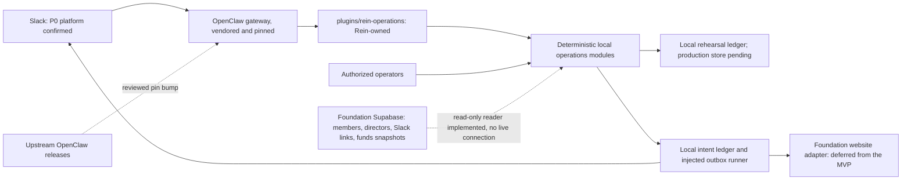
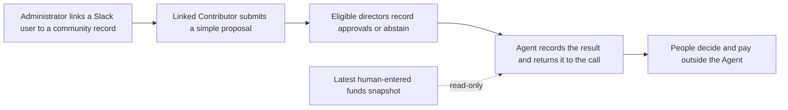

# Architecture

OpenClaw is the agent runtime. This repository vendors its official source and adds Rein Protocol
Foundation behaviour as plugins, so the runtime can be updated without carrying a fork.

## How OpenClaw is included

`vendor/openclaw` is an official OpenClaw git submodule, kept on a detached reviewed commit. The
repository records that commit as the submodule pointer, and
`.github/workflows/openclaw.yml` fails the build if a checkout has modified tracked upstream files.
Read the live values instead of trusting a number in prose:

```sh
git -C vendor/openclaw rev-parse HEAD
git ls-tree HEAD vendor/openclaw
node -p "require('./vendor/openclaw/package.json').version"
```

Updating is a reviewed pin bump, never a merge into a fork: fetch the requested ref, rebuild, run
the checks, then commit the new pointer. See [upstream](upstream.md). Local work never runs against
a global `~/.openclaw` profile; `scripts/openclaw.mjs` points the upstream CLI at
`runtime/openclaw/openclaw.json`.

## Extension boundary

The rule is plugin-first: Rein code lives in Rein-owned packages under `plugins/`, never in
`vendor/openclaw/src/` or `vendor/openclaw/extensions/`.



Discord is not drawn: no Discord surface is connected, and its general-participant scope (onboarding,
free-resource navigation and participation paths only) stays deferred behind D12 while Slack remains
the single P0 platform.

`plugins/rein-operations` registers `rein_status`, `rein_simulate_proposal` and
`rein_simulate_vote` through the public `openclaw/plugin-sdk/plugin-entry` entry point. Four v2 proposal tools are registered only with explicit single-platform, channel and storage configuration. They use host-supplied sender identity and local durable proposal records; the default three tools have no external effects. Deterministic
proposal, governance, activity, change, oversight and outbox modules can be exercised locally; authoritative registry syncing, live voting,
budgets, website publishing and production adapters remain pending. A manifest declaration is not
an authorization check.

An explicit `mvp` configuration block instead registers two database-backed read tools,
`rein_mvp_my_status` and `rein_mvp_funds`, and suppresses the synthetic simulators and the legacy
proposal bridge. They read identity links and available-funds snapshots through
`foundation-db-reader.ts`, are read-only, and fail closed when `mvp.enabled` is absent or false. No
live database is connected yet.

Nothing else is registered. The other deterministic modules, including the approve-only
tally, the weighted governance rounds and the activity, change, oversight and outbox modules, are
exercised through their module APIs in local tests and stay unregistered because the MVP excludes
their surfaces.

The required provider boundaries and timeout recovery rules are specified in
[P0 integration contracts](integration-contracts.md).

Workspace files under `workspace/` follow the
[official workspace documentation](https://docs.openclaw.ai/agent-workspace) and agent registration
follows the [agents CLI](https://docs.openclaw.ai/cli/agents). `config/operations.example.json` is a
design input; nothing loads it at runtime.

## P0 MVP vertical slice

The MVP is deliberately smaller than the PRD lifecycle: Slack identity, a simple Contributor
proposal, a simple Board approval vote with a recorded result, and a read-only funds snapshot.



| MVP step | Local code today | Still required |
| --- | --- | --- |
| Slack identity | `registry-snapshot.ts` validates a supplied snapshot and its account links; `request-context.ts` binds a host sender; `foundation-db-reader.ts` and `mvp-read-tools.ts` resolve a sender against the identity-link table. | A Slack app, approved workspace and channel IDs, and the reviewed identity-link table. The migration that adds it is uncommitted and, as reported, not applied to the live project. |
| Contributor proposal | `proposals.ts` and `proposal-store.ts` with the optional proposal bridge. | A Slack conversation wired to the bridge plus the database-backed active-Contributor source. |
| Board approval vote and result | `mvp-write-tools.ts` registers `rein_mvp_poll_open`, `rein_mvp_vote` and `rein_mvp_poll_result`; `mvp-vote-tally.ts` counts a frozen eligible list at one equal weight per member; `governance.ts` holds the older weighted round model. The registered tools still take a curator-supplied option list and do not assemble a candidate pool, apply a per-type candidate cap or enforce per-type approval budgets. | The plugin and schema update for the confirmed approve-only rule (C08, C14, C15), an approved voter list, and confirmation of the highest-count tie rule. No tool posts to Slack, so the result returns to the calling turn only. |
| Read-only funds snapshot | `foundation-db-reader.ts` reads the append-only snapshot table and `mvp-read-tools.ts` exposes `rein_mvp_funds` to approved Board channels. | A live database connection and the reviewed snapshot table, whose migration is uncommitted and, as reported, not applied to the live project. |

Weighted rounds, quorum, recusal, competing-budget allocation, payments, activity spaces, reminders,
articles, website publication and oversight are deferred from the MVP. Their local modules stay
unregistered.

One installation serves exactly one Slack workspace. The pinned runtime supplies a trusted
per-message sender (`requesterSenderId`) in an admitted Slack DM and equally in an admitted channel
or group message, so channel traffic is not a weaker source of identity than a DM. What the
version-2 tool context does not carry is a Slack team or workspace ID, so the team is fixed
operator configuration and pointing one installation at several workspaces would resolve senders
against the wrong community records.

Channel roles are separated (D12). Slack is the internal governance surface for the core circle,
meaning core board members and core contributors; Board voting, fund review and event review happen
there. Discord is the general-participant surface and is a later, separate scope: it is not
connected, and in the early Agent period it carries onboarding, free-resource navigation and
participation paths only. Identity links are held per platform and per space, so a Discord link is
evidence for the general-participant surface alone and never confers Slack governance rights; one
platform's role or channel membership never substitutes for another platform's eligibility check.
Each platform's surface stays its own scope, and no generic cross-channel business framework is
planned.

## Proposed service boundaries

The MVP needs only the Identity, Proposals and Governance rows below, in the narrow form described
above, plus a read-only view of Finance. Activities, Outcomes and Oversight are deferred.

| Boundary | Responsibilities | PRD |
| --- | --- | --- |
| Identity | Verified platform-account mapping held per platform and space; current role validity; audience scopes | R01–R03 |
| Proposals | Draft and confirmed versions; owner and material-change confirmation | R04–R09 |
| Governance | Frozen rounds; eligibility; explicit ballots; cutoff; configured tally and allocation | R10–R16 |
| Activities | Unique activity spaces; tasks, changes, handover and cancellation | R17–R20 |
| Finance | Authoritative available budget; atomic reservations; payment records entered by finance | R21–R22 |
| Outcomes | Evidence, acceptance, contributions and authorized publication | R23–R28 |
| Oversight | Exceptions, audit, scoped pauses and weekly summaries | §9, §11–13 |

Only local deterministic cores, an injected-provider outbox runner and a rehearsal ledger are implemented. Production services need
trusted adapter boundaries and provider contracts, not prompt text. Do not reuse the
Foundation's administrator-triggered application review as though it already handled this
lifecycle. Website APIs and authentication need an explicit contract.

## Proposed durable records

Member, IdentityLink, Proposal, ProposalVersion, Evaluation, GovernanceRound, VoterSnapshot, Ballot,
Allocation, Activity, Task, Reminder, Evidence, Consent, Publication, FinancialRecord, Exception,
AuditEvent and OutboxJob.

Keep immutable decision snapshots and append-only audit records. Money uses integer minor units and
an explicit currency. Store timestamps in UTC and display the configured local timezone.
Authorization checks include actor, action, resource and audience. Personal data has a separately
agreed retention policy.

For any external effect, persist intent and an idempotency key before delivery, store the provider
receipt, and reconcile uncertain outcomes before retrying. Allocate funds atomically across winning
proposals; do not resolve competition by processing order. Competing-proposal allocation is deferred
from the MVP. Database selection, migrations and provider contracts are pending.

## Three independent state dimensions

Activity: draft → confirmed → evaluating → awaiting_governance / needs_information → approved →
preparing → completed → accepted → archived; cancellation and pause are explicit transitions.

Finance: not_requested / requested / awaiting_allocation / reserved / partially_paid / paid /
awaiting_settlement / settled. Funding approval is never a payment receipt.

Publication: not_started / draft / awaiting_confirmation / ready / publishing / published / failed /
withdrawn. A confirmed version and channel-specific rights are required.

The activity core implements guarded local transitions for these dimensions. Cross-module change propagation and provider-backed recovery remain pending.

## Repository layout

| Path | Role |
| --- | --- |
| `vendor/openclaw` | Upstream runtime source; read-only, pinned by submodule pointer |
| `plugins/rein-operations` | Rein-owned plugin package and its manifest |
| `workspace/` | Agent workspace template consumed by the runtime |
| `scripts/` | Local bootstrap, CLI wrapper and upstream update helper |
| `tests/` | Node test runner checks for the plugin and the update script |
| `runtime/` | Gitignored local gateway state and config |
