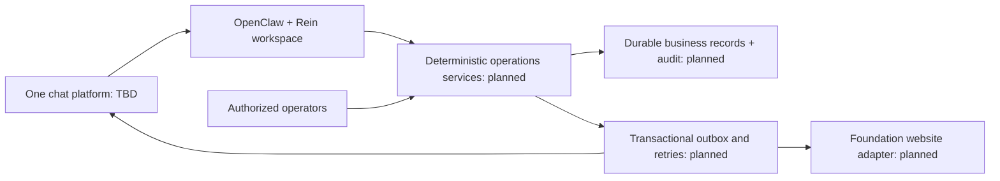

# Architecture — initial design

OpenClaw is the selected agent runtime, not a claim that the business requirements already exist. Workspace files follow the [official workspace documentation](https://docs.openclaw.ai/agent-workspace); agent registration follows the [agents CLI](https://docs.openclaw.ai/cli/agents). Consulted 2026-09-22; no runtime version is pinned or integration verified yet.

## Proposed service boundaries

| Boundary | Responsibilities | PRD |
| --- | --- | --- |
| Identity | Verified platform-account mapping; current role validity; audience scopes | R01–R03 |
| Proposals | Draft and confirmed versions; owner and material-change confirmation | R04–R09 |
| Governance | Frozen rounds; eligibility; explicit ballots; cutoff; configured tally and allocation | R10–R16 |
| Activities | Unique activity spaces; tasks, changes, handover and cancellation | R17–R20 |
| Finance | Authoritative available budget; atomic reservations; payment records entered by finance | R21–R22 |
| Outcomes | Evidence, acceptance, contributions and authorized publication | R23–R28 |
| Oversight | Exceptions, audit, scoped pauses and weekly summaries | §9, §11–13 |

No adapter is implemented. Do not reuse the Foundation's administrator-triggered application review as though it already handled this lifecycle. Website APIs and authentication need an explicit contract.

## Proposed durable records

Member, IdentityLink, Proposal, ProposalVersion, Evaluation, GovernanceRound, VoterSnapshot, Ballot, Allocation, Activity, Task, Reminder, Evidence, Consent, Publication, FinancialRecord, Exception, AuditEvent and OutboxJob.

Keep immutable decision snapshots and append-only audit records. Money uses integer minor units and an explicit currency. Store timestamps in UTC and display the configured local timezone. Authorization checks include actor, action, resource and audience. Personal data has a separately agreed retention policy.

For any external effect, persist intent and an idempotency key before delivery, store the provider receipt, and reconcile uncertain outcomes before retrying. Allocate funds atomically across winning proposals; do not resolve competition by processing order. Database selection, migrations and provider contracts are pending.

## Three independent state dimensions

Activity: draft → confirmed → evaluating → awaiting_governance / needs_information → approved → preparing → completed → accepted → archived; cancellation and pause are explicit transitions.

Finance: not_requested / requested / awaiting_allocation / reserved / partially_paid / paid / awaiting_settlement / settled. Funding approval is never a payment receipt.

Publication: not_started / draft / awaiting_confirmation / ready / publishing / published / failed / withdrawn. A confirmed version and channel-specific rights are required.

These are design vocabulary, not an implemented state machine. Specify guards and recovery transitions before coding.
