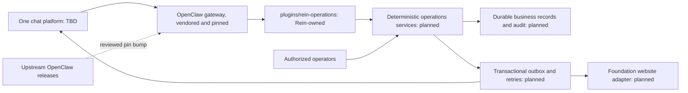

# Architecture

OpenClaw is the agent runtime. This repository vendors its official source and adds Rein Protocol
Foundation behaviour as plugins, so the runtime can be updated without carrying a fork.

## How OpenClaw is included

`vendor/openclaw` is an official OpenClaw git submodule, kept on a detached reviewed commit. The
repository records that commit as the submodule pointer, and
`.github/workflows/openclaw.yml` fails the build if a checkout has modified tracked upstream files.
Read the live values instead of trusting a number in prose:

```sh
git -C vendor/openclaw rev-parse HEAD
git ls-tree HEAD vendor/openclaw
node -p "require('./vendor/openclaw/package.json').version"
```

Updating is a reviewed pin bump, never a merge into a fork: fetch the requested ref, rebuild, run
the checks, then commit the new pointer. See [upstream](upstream.md). Local work never runs against
a global `~/.openclaw` profile; `scripts/openclaw.mjs` points the upstream CLI at
`runtime/openclaw/openclaw.json`.

## Extension boundary

The rule is plugin-first: Rein code lives in Rein-owned packages under `plugins/`, never in
`vendor/openclaw/src/` or `vendor/openclaw/extensions/`.



`plugins/rein-operations` currently registers exactly one read-only tool, `rein_status`, through the
public `openclaw/plugin-sdk/plugin-entry` entry point. It has no external effects. Membership,
proposals, voting, budgets and publishing are planned, and a manifest declaration is not an
authorization check.

Workspace files under `workspace/` follow the
[official workspace documentation](https://docs.openclaw.ai/agent-workspace) and agent registration
follows the [agents CLI](https://docs.openclaw.ai/cli/agents). `config/operations.example.json` is a
design input; nothing loads it at runtime.

## Proposed service boundaries

| Boundary | Responsibilities | PRD |
| --- | --- | --- |
| Identity | Verified platform-account mapping; current role validity; audience scopes | R01–R03 |
| Proposals | Draft and confirmed versions; owner and material-change confirmation | R04–R09 |
| Governance | Frozen rounds; eligibility; explicit ballots; cutoff; configured tally and allocation | R10–R16 |
| Activities | Unique activity spaces; tasks, changes, handover and cancellation | R17–R20 |
| Finance | Authoritative available budget; atomic reservations; payment records entered by finance | R21–R22 |
| Outcomes | Evidence, acceptance, contributions and authorized publication | R23–R28 |
| Oversight | Exceptions, audit, scoped pauses and weekly summaries | §9, §11–13 |

None of these services is implemented. Each is expected to arrive as one or more Rein-owned plugins
with deterministic authorization and durable records, not as prompt text. Do not reuse the
Foundation's administrator-triggered application review as though it already handled this
lifecycle. Website APIs and authentication need an explicit contract.

## Proposed durable records

Member, IdentityLink, Proposal, ProposalVersion, Evaluation, GovernanceRound, VoterSnapshot, Ballot,
Allocation, Activity, Task, Reminder, Evidence, Consent, Publication, FinancialRecord, Exception,
AuditEvent and OutboxJob.

Keep immutable decision snapshots and append-only audit records. Money uses integer minor units and
an explicit currency. Store timestamps in UTC and display the configured local timezone.
Authorization checks include actor, action, resource and audience. Personal data has a separately
agreed retention policy.

For any external effect, persist intent and an idempotency key before delivery, store the provider
receipt, and reconcile uncertain outcomes before retrying. Allocate funds atomically across winning
proposals; do not resolve competition by processing order. Database selection, migrations and
provider contracts are pending.

## Three independent state dimensions

Activity: draft → confirmed → evaluating → awaiting_governance / needs_information → approved →
preparing → completed → accepted → archived; cancellation and pause are explicit transitions.

Finance: not_requested / requested / awaiting_allocation / reserved / partially_paid / paid /
awaiting_settlement / settled. Funding approval is never a payment receipt.

Publication: not_started / draft / awaiting_confirmation / ready / publishing / published / failed /
withdrawn. A confirmed version and channel-specific rights are required.

These are design vocabulary, not an implemented state machine. Specify guards and recovery
transitions before coding.

## Repository layout

| Path | Role |
| --- | --- |
| `vendor/openclaw` | Upstream runtime source; read-only, pinned by submodule pointer |
| `plugins/rein-operations` | Rein-owned plugin package and its manifest |
| `workspace/` | Agent workspace template consumed by the runtime |
| `scripts/` | Local bootstrap, CLI wrapper and upstream update helper |
| `tests/` | Node test runner checks for the plugin and the update script |
| `runtime/` | Gitignored local gateway state and config |
